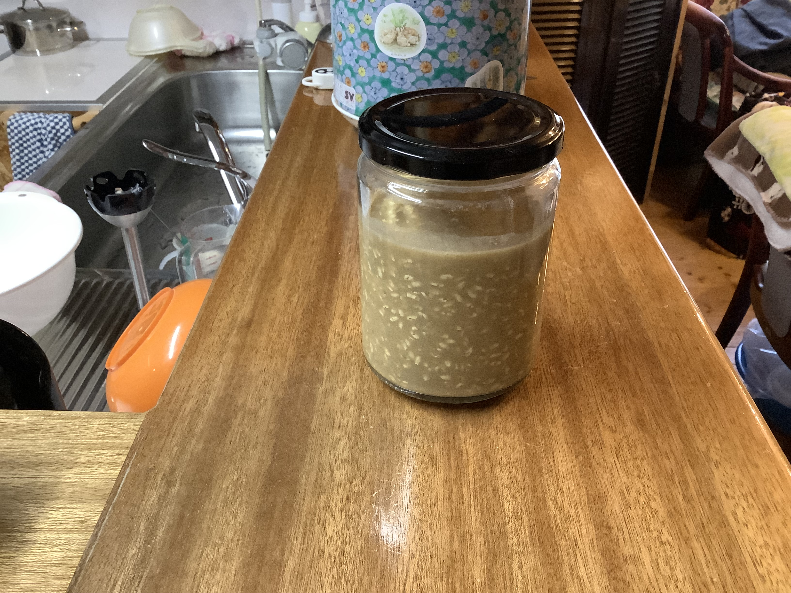
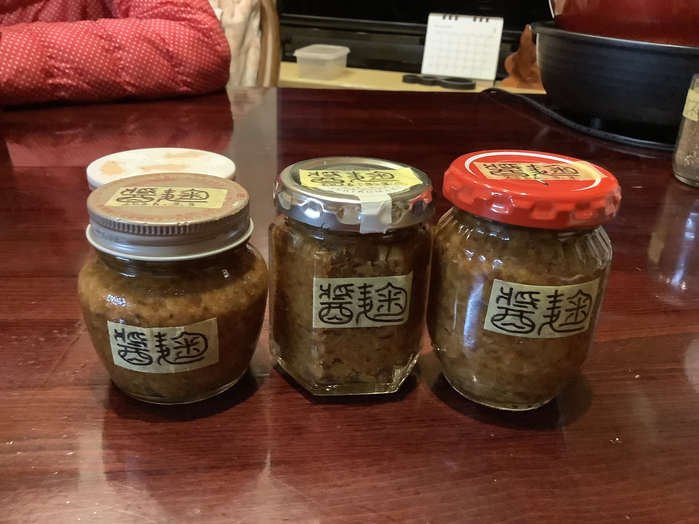

# 醤麹（ひしお こうじ）
材料を混ぜて65℃で24時間保温して脱気して保管。

### 📅 2026-03-19 醤麹

##### 🥣 recipe （水分増量）2026-03-19

|材料|割合|分量|%|備考|
|:-:|:-:|:-:|:-:|:-:|
|**麹**|1|250g|33.3%||
|**醤**|1|250g|33.3%||
|**水**|0.85|212.5ml|28.3%||
|**塩**|0.15|37.2g|5.0%||
|**合計**|3.0|749.7g|100.0%|塩分:9.5%|

##### PyKeysのREPL用ワンライナー
実行するとクリップボードにテーブルがコピーされる。

~~~python
x=250; I='麹 醤 水 塩 合計'.split(); r=[1,1,0.85]; s_s=0.16; salt=0.095; import clipboard; s_r=sum(r); t_r=max(s_r, (s_r-r[-1]*s_s)/(1-salt)); salt_amt=max(0, t_r-s_r); actual_s=(r[-1]*s_s+salt_amt)/t_r; R=r+[salt_amt, t_r]; N=['']*(len(r)+1)+[f'塩分:{round(actual_s*100,1)}%']; res="|材料|割合|分量|%|備考|\n|:-:|:-:|:-:|:-:|:-:|\n"+"\n".join(f"|**{n}**|{round(v,2)}|{round(x*v,1)}{'ml' if n in['水','酒'] else 'g'}|{round(v/t_r*100,1)}%|{note}|" for n,v,note in zip(I,R,N)); clipboard.set(res)
~~~

##### 📝 コメント
2026-03-19 理想的な水分量。

### 📅 2026-03-01 醤麹

##### 🥣 recipe 1（水分少なめ）2026-03-01

|材料|割合|分量|%|備考|
|:-:|:-:|:-:|:-:|:-:|
|**麹**|1|250g|50.0%||
|**醤**|1|250ml|50.0%||
|**塩**|0|0g|0.0%||
|**合計**|2|500g|100.0%|塩分:8.0%|

##### PyKeysのREPL用ワンライナー
実行するとクリップボードにテーブルがコピーされる。

~~~python
x=250; I='麹 醤 塩 合計'.split(); r=[1,1]; s_s=0.16; salt=0.08; import clipboard; s_r=sum(r); t_r=max(s_r, (s_r-r[-1]*s_s)/(1-salt)); salt_amt=max(0, t_r-s_r); actual_s=(r[-1]*s_s+salt_amt)/t_r; R=r+[salt_amt, t_r]; N=['']*(len(r)+1)+[f'塩分:{round(actual_s*100,1)}%']; res="|材料|割合|分量|%|備考|\n|:-:|:-:|:-:|:-:|:-:|\n"+"\n".join(f"|**{n}**|{round(v,2)}|{round(x*v,1)}{'ml' if n in['水','醤油','醤','酒'] else 'g'}|{round(v/t_r*100,1)}%|{note}|" for n,v,note in zip(I,R,N)); clipboard.set(res)
~~~

##### 📝 コメント

2026-03-04 水分量は味噌のような感じ。

---
