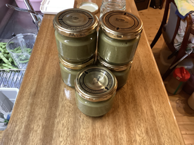

# バジル塩麹（ばじる しおこうじ）

### 📅 YYYY-MM-DD

##### 🥣 recipe（いい感じ👍）

##### PyKeysのREPL用ワンライナー
実行するとクリップボードにテーブルがコピーされる。

~~~python
x=90; I='バジル 米麹 水 塩 合計'.split(); r=[9,30,20]; s_s=0.0; salt=0.075; import clipboard; b_r=r[0]; r=[v/b_r for v in r]; s_r=sum(r); t_r=max(s_r, (s_r-r[-1]*s_s)/(1-salt)); salt_amt=max(0, t_r-s_r); actual_s=(r[-1]*s_s+salt_amt)/t_r; R=r+[salt_amt, t_r]; N=['']*(len(r)+1)+[f'塩分:{round(actual_s*100,1)}%']; res="|材料|割合|分量|%|備考|\n|:-:|:-:|:-:|:-:|:-:|\n"+"\n".join(f"|**{n}**|{round(v*b_r,2)}|{round(x*v,1)}{'ml' if n in['水','酒'] else 'g'}|{round(v/t_r*100,1)}%|{note}|" for n,v,note in zip(I,R,N)); clipboard.set(res)
~~~

##### 📝 コメント

---

### 📅 2025-09-06 バジル麹

##### 🥣 recipe（いい感じ👍）

|材料|割合|分量|%|備考|
|:-:|:-:|:-:|:-:|:-:|
|**バジル**|9.0|90.0g|14.1%||
|**米麹**|30.0|300.0g|47.0%||
|**水**|20.0|200.0ml|31.4%||
|**塩**|4.78|47.8g|7.5%||
|**合計**|63.78|637.8g|100.0%|塩分:7.5%|

##### PyKeysのREPL用ワンライナー
実行するとクリップボードにテーブルがコピーされる。

~~~python
x=90; I='バジル 米麹 水 塩 合計'.split(); r=[9,30,20]; s_s=0.0; salt=0.075; import clipboard; b_r=r[0]; r=[v/b_r for v in r]; s_r=sum(r); t_r=max(s_r, (s_r-r[-1]*s_s)/(1-salt)); salt_amt=max(0, t_r-s_r); actual_s=(r[-1]*s_s+salt_amt)/t_r; R=r+[salt_amt, t_r]; N=['']*(len(r)+1)+[f'塩分:{round(actual_s*100,1)}%']; res="|材料|割合|分量|%|備考|\n|:-:|:-:|:-:|:-:|:-:|\n"+"\n".join(f"|**{n}**|{round(v*b_r,2)}|{round(x*v,1)}{'ml' if n in['水','酒'] else 'g'}|{round(v/t_r*100,1)}%|{note}|" for n,v,note in zip(I,R,N)); clipboard.set(res)
~~~

##### 📝 コメント

---

2025-09-06 20:03 シンデレラ950で65℃で保温開始。

2025-09-07 12:24 口の中がバジル‼️。

65.5-47.8 = 17.700000000000003

2025-09-07 13:00 水100mlと塩17.7gを追加しブレンダーをかける。

2025-09-07 13:01 濃くて旨くて塩っぱい👍口の中いっぱいのバジル‼️

  

小瓶150g×4

小瓶140g

