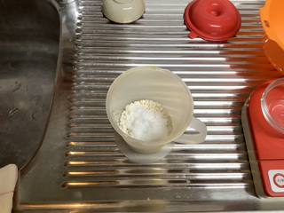
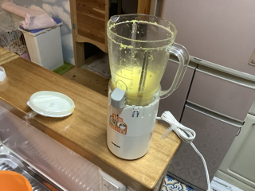
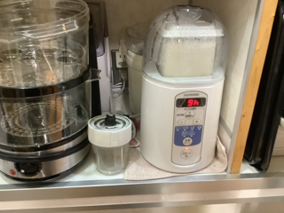

# 柚子塩麹（ゆず しおこうじ）

### 📅 YYYY-MM-DD

##### 🥣 recipe（いい感じ👍）

##### PyKeysのREPL用ワンライナー
実行するとクリップボードにテーブルがコピーされる。

~~~python
x=436; I='ねぎ 黴米乳酸麹 水 塩 合計'.split(); r=[4,2,1]; s_s=0.00; salt=0.125; import clipboard; b_r=r[0]; r=[v/b_r for v in r]; s_r=sum(r); t_r=max(s_r, (s_r-r[-1]*s_s)/(1-salt)); salt_amt=max(0, t_r-s_r); actual_s=(r[-1]*s_s+salt_amt)/t_r; R=r+[salt_amt, t_r]; N=['']*(len(r)+1)+[f'塩分:{round(actual_s*100,1)}%']; res="|材料|割合|分量|%|備考|\n|:-:|:-:|:-:|:-:|:-:|\n"+"\n".join(f"|**{n}**|{round(v*b_r,2)}|{round(x*v,1)}{'ml' if n in['水','酒'] else 'g'}|{round(v/t_r*100,1)}%|{note}|" for n,v,note in zip(I,R,N)); clipboard.set(res)
~~~

##### 📝 コメント

---

### 📅 2025-11-26 柚子塩麹

##### 🥣 recipe（いい感じ👍）

|材料|割合|分量|%|備考|
|:-:|:-:|:-:|:-:|:-:|
|**柚子皮**|1.0|50.0g|17.9%||
|**米麹**|2.0|100.0g|35.7%||
|**柚子果汁**|1.0|50.0g|17.9%||
|**水**|1.0|50.0ml|17.9%||
|**塩**|0.6|30.0g|10.7%||
|**合計**|5.6|280.0g|100.0%|塩分:10.7%|

2025-11-27 18:19 糊状。150mlの水を足す。

|材料|割合|分量|%|備考|
|:-:|:-:|:-:|:-:|:-:|
|**柚子皮**|1.0|50.0g|11.6%||
|**米麹**|2.0|100.0g|23.3%||
|**柚子果汁**|1.0|50.0g|11.6%||
|**水**|4.0|200.0ml|46.5%||
|**塩**|0.6|30.0g|7.0%||
|**合計**|8.6|430.0g|100.0%|塩分:7.0%|

##### PyKeysのREPL用ワンライナー
実行するとクリップボードにテーブルがコピーされる。

~~~python
x=50; I='柚子皮 米麹 柚子果汁 水 塩 合計'.split(); r=[1,2,1,4]; s_s=0.00; salt=0.0697; import clipboard; b_r=r[0]; r=[v/b_r for v in r]; s_r=sum(r); t_r=max(s_r, (s_r-r[-1]*s_s)/(1-salt)); salt_amt=max(0, t_r-s_r); actual_s=(r[-1]*s_s+salt_amt)/t_r; R=r+[salt_amt, t_r]; N=['']*(len(r)+1)+[f'塩分:{round(actual_s*100,1)}%']; res="|材料|割合|分量|%|備考|\n|:-:|:-:|:-:|:-:|:-:|\n"+"\n".join(f"|**{n}**|{round(v*b_r,2)}|{round(x*v,1)}{'ml' if n in['水','酒'] else 'g'}|{round(v/t_r*100,1)}%|{note}|" for n,v,note in zip(I,R,N)); clipboard.set(res)
~~~

##### 📝 コメント

2025-11-26 12:00 柚子の皮50gと水100mlをミキサーにかける。

2025-11-26 13:25 米麹100gと塩を30gを混ぜ合わせる。

2025-11-26 13:35 柚子皮ペーストと柚子果汁50mlも加え混ぜ混ぜ。

2025-11-26 13:45 シンデレラ650に入れ48℃で保温開始。

2025-11-26 20:00 保温温度を60℃に変更。

2025-11-27 11:43 旨いけど糊状。

2025-11-27 18:19 糊状。150mlの水を足す。

---

### 📅 2025-02-15 12:00

伊予柑塩麹
1. カットした伊予柑をミルサーで粉砕する。
2. 容器にへばりつき塊が残る。
3. 水を20ml加え流動性を持たせて完全粉砕する。
4. 塩と麹を加えてミルサーで混ぜ保存容器に移す。
*全体が20%増したのに塩を追加してない。

