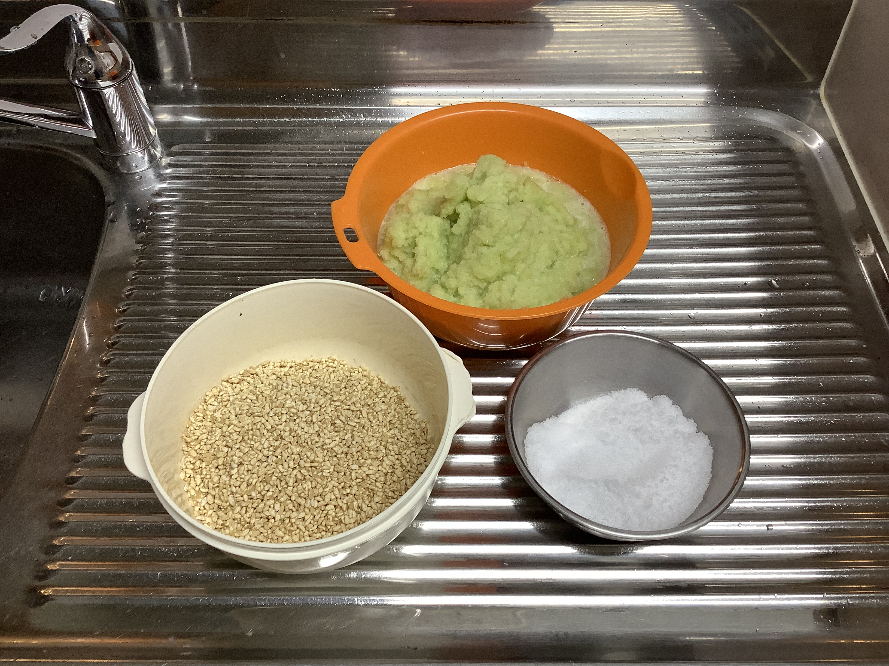
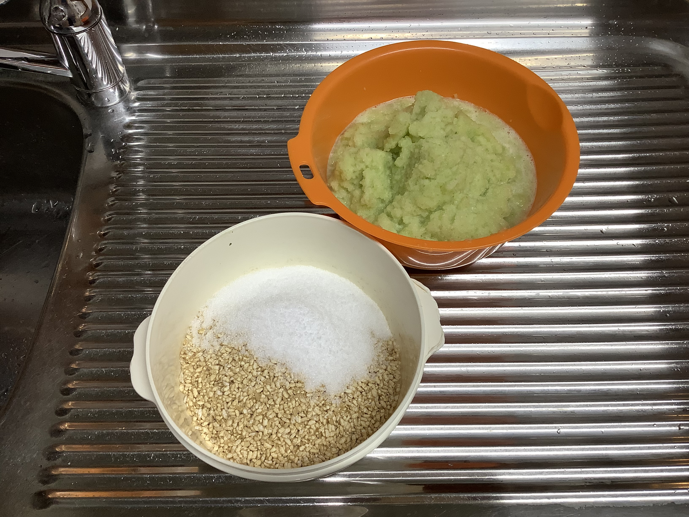
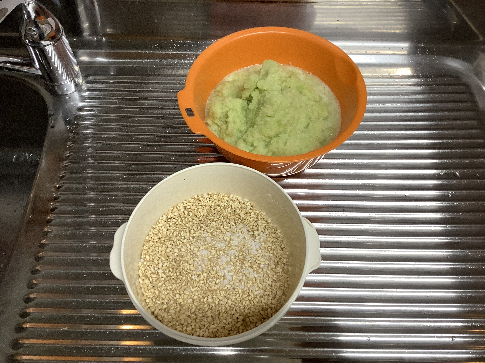
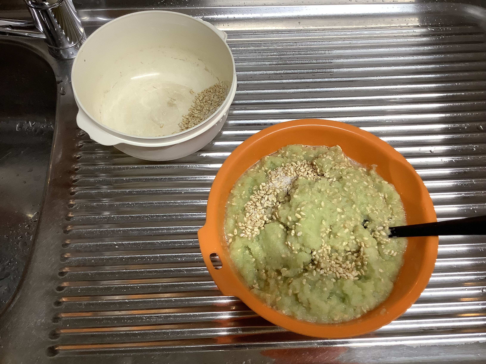
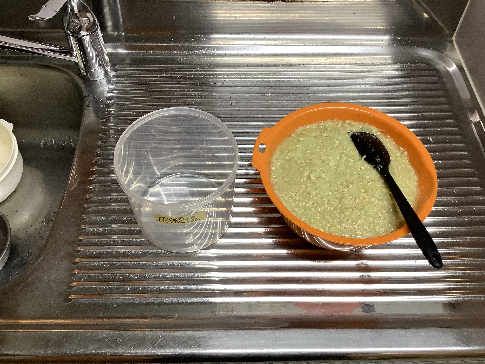
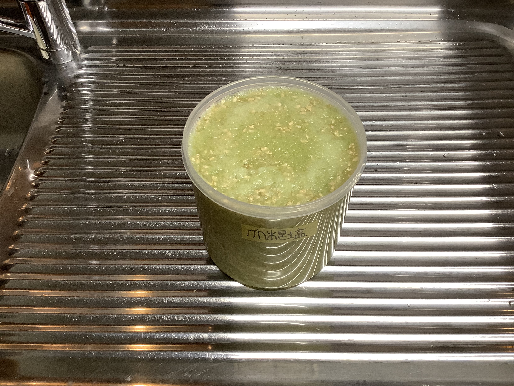
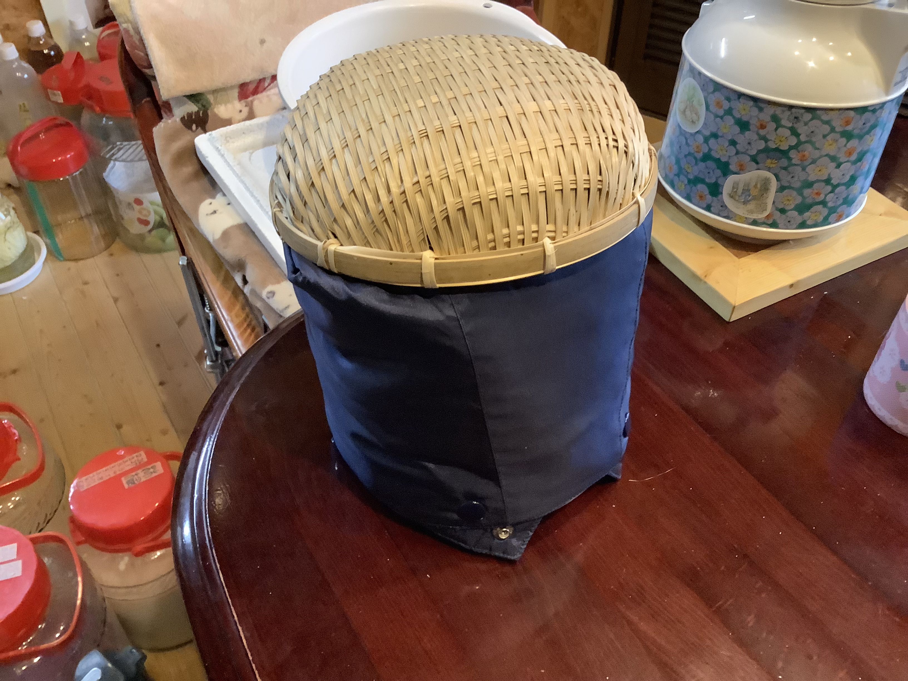

# 大根塩麹（だいこん しお こうじ）

### 📅 YYYY-MM-DD

##### 🥣 recipe（いい感じ👍）

|材料|割合|分量|%|備考|
|:-:|:-:|:-:|:-:|:-:|
|**大根**|3.0|900.0g|69.8%||
|**米麹**|1.0|300.0g|23.2%||
|**塩**|0.1|90.3g|7.0%|塩分:100%|
|**合計**|1.43|1290.3g|100.0%|全体塩分:7.0%|

|材料|割合|分量|%|備考|
|:-:|:-:|:-:|:-:|:-:|
|**大根**|3.0|950.0g|69.8%||
|**米麹**|1.0|316.7g|23.2%||
|**塩**|0.1|95.3g|7.0%|塩分:100%|
|**合計**|1.43|1362.0g|100.0%|全体塩分:7.0%|

|   材料   |  割合  |   分量    |   %    |    備考     |
| :----: | :--: | :-----: | :----: | :-------: |
| **大根** | 3.0  | 960.0g  | 69.8%  |           |
| **米麹** | 1.0  | 320.0g  | 23.2%  |           |
| **塩**  | 0.1  |  96.3g  |  7.0%  |  塩分:100%  |
| **合計** | 1.43 | 1376.3g | 100.0% | 全体塩分:7.0% |

##### PyKeysのREPL用ワンライナー
実行するとクリップボードにテーブルがコピーされる。

~~~python
x=990; I='大根 黴米乳酸麹 塩 合計'.split(); r=[3,1]; s_s=0.00; salt=0.07; import clipboard; b_r=r[0]; r=[v/b_r for v in r]; s_r=sum(r); t_r=max(s_r, (s_r-r[-1]*s_s)/(1-salt)); salt_amt=max(0, t_r-s_r); actual_s=(r[-1]*s_s+salt_amt)/t_r; R=r+[salt_amt, t_r]; N=['']*(len(r)+1)+[f'塩分:{round(actual_s*100,1)}%']; res="|材料|割合|分量|%|備考|\n|:-:|:-:|:-:|:-:|:-:|\n"+"\n".join(f"|**{n}**|{round(v*b_r,2)}|{round(x*v,1)}{'ml' if n in['水','酒'] else 'g'}|{round(v/t_r*100,1)}%|{note}|" for n,v,note in zip(I,R,N)); clipboard.set(res)

x=960; I='大根 米麹 塩 合計'.split(); r=[3,1]; s_s=[0,0]; salt=0.07; import clipboard; b_r=r[0]; r_norm=[v/b_r for v in r]; s_r=sum(r_norm); liq_s=sum(v*s for v,s in zip(r_norm, s_s)); t_r=max(s_r, (s_r-liq_s)/(1-salt)); s_amt=max(0, t_r-s_r); act_s=(liq_s+s_amt)/t_r; R=r_norm+[s_amt, t_r]; N=[f'塩分:{round(s*100,1)}%' if s != 0 else '' for s in s_s]+[f'塩分:100%']+[f'全体塩分:{round(act_s*100,1)}%']; res="|材料|割合|分量|%|備考|\n|:-:|:-:|:-:|:-:|:-:|\n"+"\n".join(f"|**{n}**|{round(v*b_r,2) if i<len(r) else round(v,2)}|{round(x*v,1)}{'ml' if n in['水','醤油','酒'] else 'g'}|{round(v/t_r*100,1)}%|{note}|" for i,(n,v,note) in enumerate(zip(I,R,N))); clipboard.set(res)
~~~

##### 📝 コメント

---

### 📅 2026-03-30 つる爺大根塩麹

##### 🥣 recipe（いい感じ👍）

|    材料     |  割合  |   分量    |   %    |    備考     |
| :-------: | :--: | :-----: | :----: | :-------: |
| **つる爺大根** | 3.0  | 900.0g  | 69.8%  |           |
|  **玄米麹**  | 1.0  | 300.0g  | 23.2%  |           |
|   **塩**   | 0.1  |  90.3g  |  7.0%  |  塩分:100%  |
|  **合計**   | 1.43 | 1290.3g | 100.0% | 全体塩分:7.0% |

##### PyKeysのREPL用ワンライナー
実行するとクリップボードにテーブルがコピーされる。

~~~python
x=900; I='つる爺大根 玄米麹 塩 合計'.split(); r=[3,1]; s_s=[0,0]; salt=0.07; import clipboard; b_r=r[0]; r_norm=[v/b_r for v in r]; s_r=sum(r_norm); liq_s=sum(v*s for v,s in zip(r_norm, s_s)); t_r=max(s_r, (s_r-liq_s)/(1-salt)); s_amt=max(0, t_r-s_r); act_s=(liq_s+s_amt)/t_r; R=r_norm+[s_amt, t_r]; N=[f'塩分:{round(s*100,1)}%' if s != 0 else '' for s in s_s]+[f'塩分:100%']+[f'全体塩分:{round(act_s*100,1)}%']; res="|材料|割合|分量|%|備考|\n|:-:|:-:|:-:|:-:|:-:|\n"+"\n".join(f"|**{n}**|{round(v*b_r,2) if i<len(r) else round(v,2)}|{round(x*v,1)}{'ml' if n in['水','醤油','酒'] else 'g'}|{round(v/t_r*100,1)}%|{note}|" for i,(n,v,note) in enumerate(zip(I,R,N))); clipboard.set(res)
~~~

##### 📝 コメント

2026-03-30 14:17:30 材料。

2026-03-30 14:17:40 麹に塩を加える。

2026-03-30 14:18 浴回混ぜて塩きり麹を作る。

2026-03-30 14:20 大根に塩きり麹を混ぜながら加える。

2026-03-30 14:23 良く混ぜてタッパーに移す。

2026-03-30 14:28 ギリ入った。（机上値1290g）

2026-03-30 14:41 保温開始。

---

### 📅 2026-01-18 大根塩麹

##### 🥣 recipe（いい感じ👍）

|材料|割合|分量|%|備考|
|:-:|:-:|:-:|:-:|:-:|
|**大根**|3.0|990.0g|69.8%||
|**黴米乳酸麹**|1.0|330.0g|23.2%||
|**塩**|0.3|99.4g|7.0%||
|**合計**|4.3|1419.4g|100.0%|塩分:7.0%|

##### PyKeysのREPL用ワンライナー
実行するとクリップボードにテーブルがコピーされる。

~~~python
x=990; I='大根 黴米乳酸麹 塩 合計'.split(); r=[3,1]; s_s=0.00; salt=0.07; import clipboard; b_r=r[0]; r=[v/b_r for v in r]; s_r=sum(r); t_r=max(s_r, (s_r-r[-1]*s_s)/(1-salt)); salt_amt=max(0, t_r-s_r); actual_s=(r[-1]*s_s+salt_amt)/t_r; R=r+[salt_amt, t_r]; N=['']*(len(r)+1)+[f'塩分:{round(actual_s*100,1)}%']; res="|材料|割合|分量|%|備考|\n|:-:|:-:|:-:|:-:|:-:|\n"+"\n".join(f"|**{n}**|{round(v*b_r,2)}|{round(x*v,1)}{'ml' if n in['水','酒'] else 'g'}|{round(v/t_r*100,1)}%|{note}|" for n,v,note in zip(I,R,N)); clipboard.set(res)
~~~

##### 📝 コメント

2026-01-18 15:11 保温開始。

---

### 📅 2026-01-03 大根塩麹

##### 🥣 recipe（いい感じ👍）

|材料|割合|分量|%|備考|
|:-:|:-:|:-:|:-:|:-:|
|**大根**|3.0|834.0g|69.8%||
|**黴米乳酸麹**|1.0|278.0g|23.2%||
|**塩**|0.3|83.7g|7.0%||
|**合計**|4.3|1195.7g|100.0%|塩分:7.0%

##### PyKeysのREPL用ワンライナー
実行するとクリップボードにテーブルがコピーされる。

~~~python
x=834; I='大根 黴米乳酸麹 塩 合計'.split(); r=[3,1]; s_s=0.00; salt=0.07; import clipboard; b_r=r[0]; r=[v/b_r for v in r]; s_r=sum(r); t_r=max(s_r, (s_r-r[-1]*s_s)/(1-salt)); salt_amt=max(0, t_r-s_r); actual_s=(r[-1]*s_s+salt_amt)/t_r; R=r+[salt_amt, t_r]; N=['']*(len(r)+1)+[f'塩分:{round(actual_s*100,1)}%']; res="|材料|割合|分量|%|備考|\n|:-:|:-:|:-:|:-:|:-:|\n"+"\n".join(f"|**{n}**|{round(v*b_r,2)}|{round(x*v,1)}{'ml' if n in['水','酒'] else 'g'}|{round(v/t_r*100,1)}%|{note}|" for n,v,note in zip(I,R,N)); clipboard.set(res)
~~~

##### 📝 コメント

2026-01-03 17:40 材料を全部混ぜて保温開始。

---

### 📅 2025-12-09 大根おろし塩麹

##### 🥣 recipe（いい感じ👍）

##### PyKeysのREPL用ワンライナー
実行するとクリップボードにテーブルがコピーされる。

~~~python
x=800; I='大根 黴米乳酸麹 塩 合計'.split(); r=[3,1]; s_s=0.00; salt=0.07; import clipboard; b_r=r[0]; r=[v/b_r for v in r]; s_r=sum(r); t_r=max(s_r, (s_r-r[-1]*s_s)/(1-salt)); salt_amt=max(0, t_r-s_r); actual_s=(r[-1]*s_s+salt_amt)/t_r; R=r+[salt_amt, t_r]; N=['']*(len(r)+1)+[f'塩分:{round(actual_s*100,1)}%']; res="|材料|割合|分量|%|備考|\n|:-:|:-:|:-:|:-:|:-:|\n"+"\n".join(f"|**{n}**|{round(v*b_r,2)}|{round(x*v,1)}{'ml' if n in['水','酒'] else 'g'}|{round(v/t_r*100,1)}%|{note}|" for n,v,note in zip(I,R,N)); clipboard.set(res)
~~~

##### 📝 コメント

2025-12-09 12:12 うま旨い。粒感が気になる。
2025-12-08 14:53 保温開始。

---