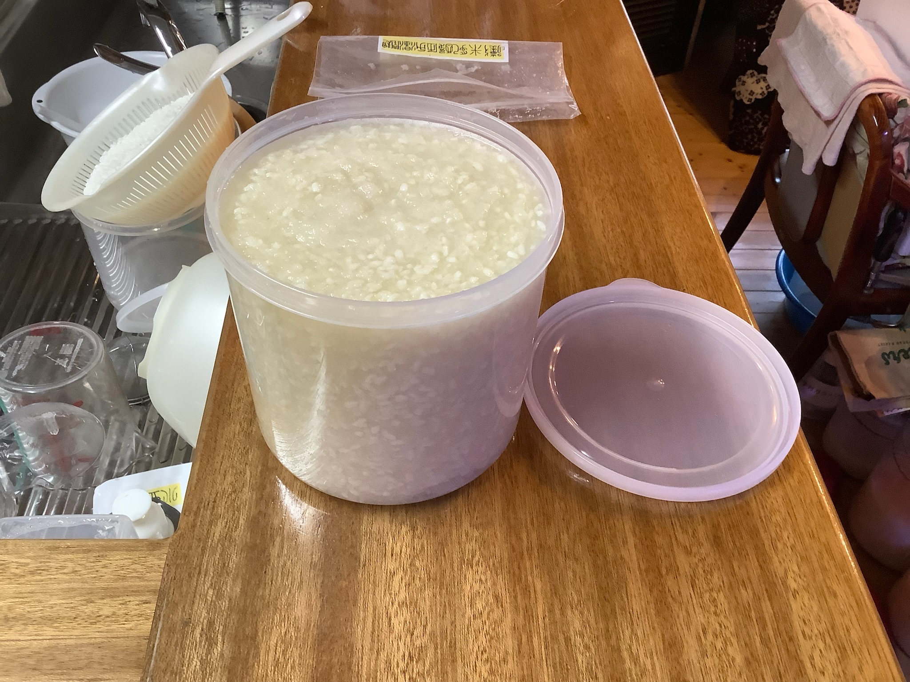
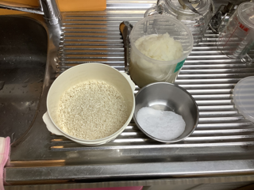
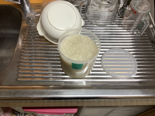

# 大根塩麹（だいこん しお こうじ）

### 📅 YYYY-MM-DD

##### 🥣 recipe（いい感じ👍）

##### PyKeysのREPL用ワンライナー
実行するとクリップボードにテーブルがコピーされる。

~~~python
x=990; I='大根 黴米乳酸麹 塩 合計'.split(); r=[3,1]; s_s=0.00; salt=0.07; import clipboard; b_r=r[0]; r=[v/b_r for v in r]; s_r=sum(r); t_r=max(s_r, (s_r-r[-1]*s_s)/(1-salt)); salt_amt=max(0, t_r-s_r); actual_s=(r[-1]*s_s+salt_amt)/t_r; R=r+[salt_amt, t_r]; N=['']*(len(r)+1)+[f'塩分:{round(actual_s*100,1)}%']; res="|材料|割合|分量|%|備考|\n|:-:|:-:|:-:|:-:|:-:|\n"+"\n".join(f"|**{n}**|{round(v*b_r,2)}|{round(x*v,1)}{'ml' if n in['水','酒'] else 'g'}|{round(v/t_r*100,1)}%|{note}|" for n,v,note in zip(I,R,N)); clipboard.set(res)
~~~

##### 📝 コメント

---
### 📅 2026-01-18 大根塩麹

##### 🥣 recipe（いい感じ👍）

|材料|割合|分量|%|備考|
|:-:|:-:|:-:|:-:|:-:|
|**大根**|3.0|990.0g|69.8%||
|**黴米乳酸麹**|1.0|330.0g|23.2%||
|**塩**|0.3|99.4g|7.0%||
|**合計**|4.3|1419.4g|100.0%|塩分:7.0%|

##### PyKeysのREPL用ワンライナー
実行するとクリップボードにテーブルがコピーされる。

~~~python
x=990; I='大根 黴米乳酸麹 塩 合計'.split(); r=[3,1]; s_s=0.00; salt=0.07; import clipboard; b_r=r[0]; r=[v/b_r for v in r]; s_r=sum(r); t_r=max(s_r, (s_r-r[-1]*s_s)/(1-salt)); salt_amt=max(0, t_r-s_r); actual_s=(r[-1]*s_s+salt_amt)/t_r; R=r+[salt_amt, t_r]; N=['']*(len(r)+1)+[f'塩分:{round(actual_s*100,1)}%']; res="|材料|割合|分量|%|備考|\n|:-:|:-:|:-:|:-:|:-:|\n"+"\n".join(f"|**{n}**|{round(v*b_r,2)}|{round(x*v,1)}{'ml' if n in['水','酒'] else 'g'}|{round(v/t_r*100,1)}%|{note}|" for n,v,note in zip(I,R,N)); clipboard.set(res)
~~~

##### 📝 コメント

2026-01-18 15:11 保温開始。

---

### 📅 2026-01-03 大根塩麹

##### 🥣 recipe（いい感じ👍）

|材料|割合|分量|%|備考|
|:-:|:-:|:-:|:-:|:-:|
|**大根**|3.0|834.0g|69.8%||
|**黴米乳酸麹**|1.0|278.0g|23.2%||
|**塩**|0.3|83.7g|7.0%||
|**合計**|4.3|1195.7g|100.0%|塩分:7.0%

##### PyKeysのREPL用ワンライナー
実行するとクリップボードにテーブルがコピーされる。

~~~python
x=834; I='大根 黴米乳酸麹 塩 合計'.split(); r=[3,1]; s_s=0.00; salt=0.07; import clipboard; b_r=r[0]; r=[v/b_r for v in r]; s_r=sum(r); t_r=max(s_r, (s_r-r[-1]*s_s)/(1-salt)); salt_amt=max(0, t_r-s_r); actual_s=(r[-1]*s_s+salt_amt)/t_r; R=r+[salt_amt, t_r]; N=['']*(len(r)+1)+[f'塩分:{round(actual_s*100,1)}%']; res="|材料|割合|分量|%|備考|\n|:-:|:-:|:-:|:-:|:-:|\n"+"\n".join(f"|**{n}**|{round(v*b_r,2)}|{round(x*v,1)}{'ml' if n in['水','酒'] else 'g'}|{round(v/t_r*100,1)}%|{note}|" for n,v,note in zip(I,R,N)); clipboard.set(res)
~~~

##### 📝 コメント

2026-01-03 17:40 材料を全部混ぜて保温開始。

---