# 発酵トマト塩麹（はっこう とまと しおこうじ）

### 📅 YYYY-MM-DD

##### 🥣 recipe（いい感じ👍）

##### PyKeysのREPL用ワンライナー
実行するとクリップボードにテーブルがコピーされる。

~~~python
x=100; I='米麹 水 発酵トマト 塩 合計'.split(); r=[1,1,1]; s_s=0.02; salt=0.075; import clipboard; b_r=r[0]; r=[v/b_r for v in r]; s_r=sum(r); t_r=max(s_r, (s_r-r[-1]*s_s)/(1-salt)); salt_amt=max(0, t_r-s_r); actual_s=(r[-1]*s_s+salt_amt)/t_r; R=r+[salt_amt, t_r]; N=['']*(len(r)+1)+[f'塩分:{round(actual_s*100,1)}%']; res="|材料|割合|分量|%|備考|\n|:-:|:-:|:-:|:-:|:-:|\n"+"\n".join(f"|**{n}**|{round(v*b_r,2)}|{round(x*v,1)}{'ml' if n in['水','酒'] else 'g'}|{round(v/t_r*100,1)}%|{note}|" for n,v,note in zip(I,R,N)); clipboard.set(res)
~~~

##### 📝 コメント

---

### 📅 2026-03-27 発酵トマト塩甘酒

##### 🥣 recipe（いい感じ👍）

|材料|割合|分量|%|備考|
|:-:|:-:|:-:|:-:|:-:|
|**甘酒**|3.0|150.0g|46.8%||
|**水**|1.0|50.0ml|15.6%||
|**発酵トマト**|2.0|100.0g|31.2%||
|**塩**|0.41|20.4g|6.4%||
|**合計**|6.41|320.4g|100.0%|塩分:7.0%|
甘酒のレシピ
米 600
水 1000
玄米麹 150
水 200

##### PyKeysのREPL用ワンライナー
実行するとクリップボードにテーブルがコピーされる。
~~~python
x=150; I='甘酒 水 発酵トマト 塩 合計'.split(); r=[3,1,2]; s_s=0.02; salt=0.07; import clipboard; b_r=r[0]; r=[v/b_r for v in r]; s_r=sum(r); t_r=max(s_r, (s_r-r[-1]*s_s)/(1-salt)); salt_amt=max(0, t_r-s_r); actual_s=(r[-1]*s_s+salt_amt)/t_r; R=r+[salt_amt, t_r]; N=['']*(len(r)+1)+[f'塩分:{round(actual_s*100,1)}%']; res="|材料|割合|分量|%|備考|\n|:-:|:-:|:-:|:-:|:-:|\n"+"\n".join(f"|**{n}**|{round(v*b_r,2)}|{round(x*v,1)}{'ml' if n in['水','酒'] else 'g'}|{round(v/t_r*100,1)}%|{note}|" for n,v,note in zip(I,R,N)); clipboard.set(res)
~~~

##### 📝 コメント

中瓶260にスレスレ。

---

### 📅 2025-10-22 発酵トマト塩麹🍅

##### 🥣 recipe（2025-10-22 糊状）
salt=0.0747

|材料|割合|分量|%|備考|
|:-:|:-:|:-:|:-:|:-:|
|**米麹**|1.0|150.0g|37.3%||
|**水**|0.5|75.0ml|18.7%||
|**発酵トマト**|1.0|150.0g|37.3%||
|**塩**|0.18|27.0g|6.7%||
|**合計**|2.68|402.0g|100.0%|塩分:7.5%|

##### 🥣 recipe（トロトロ 7.3%）
水350mlと塩27gを加える。

|材料|割合|分量|%|備考|
|:-:|:-:|:-:|:-:|:-:|
|**米麹**|1.0|150.0g|19.3%||
|**水**|0.5|75.0ml|9.6%||
|**水**|2.33|350.0ml|44.9%||
|**発酵トマト**|1.0|150.0g|19.3%||
|**塩**|0.36|54.0g|6.9%||
|**合計**|5.19|779.0g|100.0%|塩分:7.3%|

##### 🥣 recipe（トロトロ 9.0%） 
実際は上記レシピの半分に9gの塩を加えただけ。

|材料|割合|分量|%|備考|
|:-:|:-:|:-:|:-:|:-:|
|**米麹**|1.0|75.0g|18.8%||
|**水**|0.5|37.5ml|9.4%||
|**水**|2.33|175.0ml|43.9%||
|**発酵トマト**|1.0|75.0g|18.8%||
|**塩**|0.48|36.0g|9.0%||
|**合計**|5.31|398.5g|100.0%|塩分:9.4%|

##### PyKeysのREPL用ワンライナー
実行するとクリップボードにテーブルがコピーされる。

~~~python
x=75; I='米麹 水 水 発酵トマト 塩 合計'.split(); r=[1,0.5,350/150,1]; s_s=0.02; salt=0.0941; import clipboard; b_r=r[0]; r=[v/b_r for v in r]; s_r=sum(r); t_r=max(s_r, (s_r-r[-1]*s_s)/(1-salt)); salt_amt=max(0, t_r-s_r); actual_s=(r[-1]*s_s+salt_amt)/t_r; R=r+[salt_amt, t_r]; N=['']*(len(r)+1)+[f'塩分:{round(actual_s*100,1)}%']; res="|材料|割合|分量|%|備考|\n|:-:|:-:|:-:|:-:|:-:|\n"+"\n".join(f"|**{n}**|{round(v*b_r,2)}|{round(x*v,1)}{'ml' if n in['水','酒'] else 'g'}|{round(v/t_r*100,1)}%|{note}|" for n,v,note in zip(I,R,N)); clipboard.set(res)
~~~

##### 📝 コメント

20251022_

2025-10-22 11:01 ヨーグルトメーカーで65℃で保温開始。
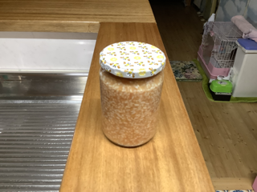

2025-10-22 23:03 糊のような仕上がり。塩水を加えてゆるめようと思う。

608-256 = 352g # ???

2025-10-23 10:00 水を350mlと塩を27gを加えブレンダー。

2025-10-23 10:10 約半分の360gを瓶詰め。
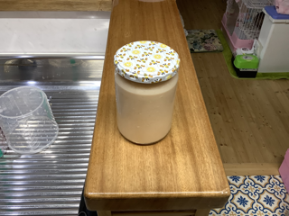

2025-10-23 19:16 残りに9gの塩を加る。
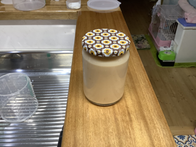

---

### 2025-10-05 発酵トマト🍅

ガラス瓶4ℓ 1613g

2997+32-1613 = 1416g

塩2%（28.32g）

聖水10ml

2025-10-05 21:09 瓶詰め
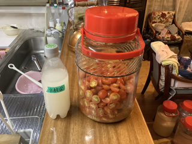

2025-10-08 23:38 シュワうま。

2025-10-09 00:30 鍋の出汁にお玉一杯使用したらうまうま👍。

2025-10-11 14:51 冷凍トマトを追加。（多分500g）

2025-10-12 17:53 採れたてトマト350g追加。

2025-10-12 18:03 塩17g（追加分の2%）追加。

2025-10-13 20:00 鍋にオタマひとつで旨さ爆発👍。 

2025-10-16 11:54 表面に白い膜ができる。毎日攪拌する。
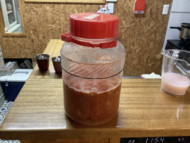

2025-10-16 20:05 白い膜。攪拌する。
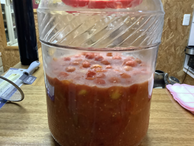

2025-10-17 11:59 白い膜。攪拌する。
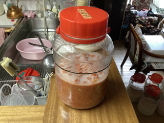

2025-10-18 11:33 白い膜。攪拌する。
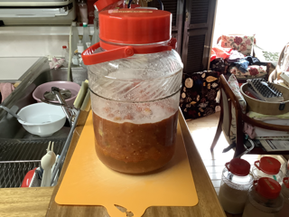

2025-10-21 17:45 ミニトマト400gと塩8g（2%）追加。
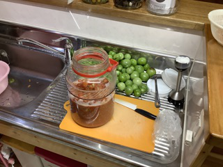

2025-10-21 21:04 ミニトマト50gと塩1g（2%）追加。

2025-11-05 11:06 ガラス瓶2.2ℓに移し替える。
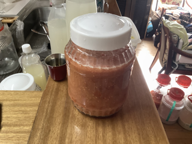

2025-12-21 18:18 トマト335gと塩7g（2%）追加。
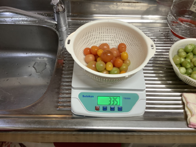

---

### 📅 2025-02-15 12:00

トマト麹

1. カットした冷凍トマトをミルサーで粉砕。
2. 凍ってるから粉砕されたものが容器にへばりつき塊が残る。
3. 容器を温めて中のトマトを溶かしたら流動性が増し完全粉砕できた。
4. 麹と塩を入れミルサーで混ぜ保存容器に移す。

