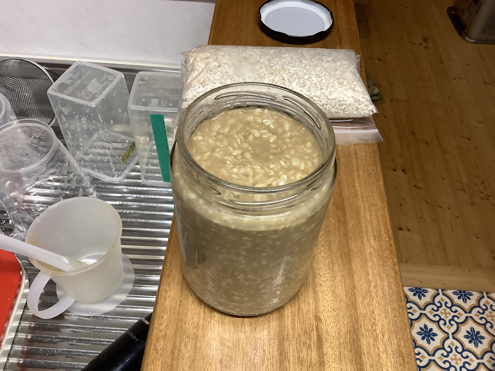
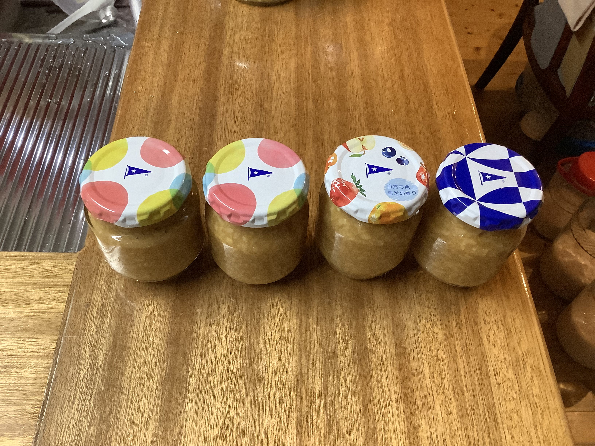
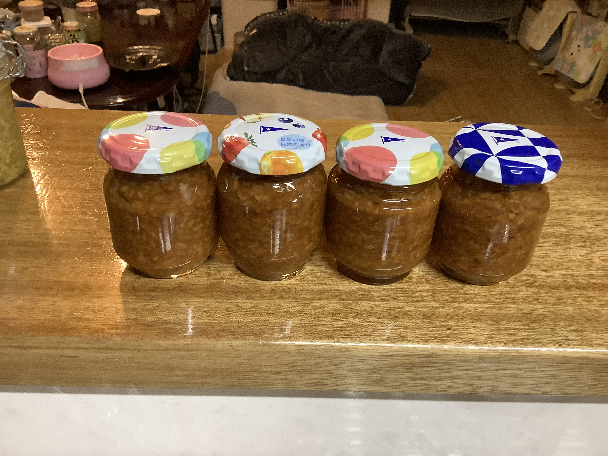

# 醤麹（ひしお こうじ）
材料を混ぜて65℃で24時間保温して脱気して保管。

### 📅 YYYY-MM-DD

##### 🥣 recipe（いい感じ👍）

##### PyKeysのREPL用ワンライナー
実行するとクリップボードにテーブルがコピーされる。

~~~python
x=250; I='醤 白米麹 水 塩 合計'.split(); r=[2.5,2.5,1]; s_s=[0.16,0,0]; salt=0.08; import clipboard; b_r=r[0]; r_norm=[v/b_r for v in r]; s_r=sum(r_norm); liq_s=sum(v*s for v,s in zip(r_norm, s_s)); t_r=max(s_r, (s_r-liq_s)/(1-salt)); s_amt=max(0, t_r-s_r); act_s=(liq_s+s_amt)/t_r; R=r_norm+[s_amt, t_r]; N=[f'塩分:{round(s*100,1)}%' if s != 0 else '' for s in s_s]+[f'塩分:100%']+[f'全体塩分:{round(act_s*100,1)}%']; res="|材料|割合|分量|%|備考|\n|:-:|:-:|:-:|:-:|:-:|\n"+"\n".join(f"|**{n}**|{round(v*b_r,2) if i<len(r) else round(v,2)}|{round(x*v,1)}{'ml' if n in['水','醤油','酒'] else 'g'}|{round(v/t_r*100,1)}%|{note}|" for i,(n,v,note) in enumerate(zip(I,R,N))); clipboard.set(res)
~~~

##### 📝 コメント

---
### 📅 醤ソース麹

##### 🥣 recipe（いい感じ👍）
###### 主材料

|    材料     |  割合  |   分量   |   %    |    備考     |
| :-------: | :--: | :----: | :----: | :-------: |
|   **醤**   | 1.0  | 100.0g | 24.2%  | 塩分:16.0%  |
| **発酵トマト** | 0.5  | 50.0g  | 12.1%  |  塩分:2.0%  |
|  **林檎酢**  | 1.0  | 100.0g | 24.2%  |           |
|  **甘酒**   | 1.0  | 100.0g | 24.2%  |           |
|   **水**   | 0.5  | 50.0ml | 12.1%  |           |
|   **塩**   | 0.14 | 14.1g  |  3.4%  |  塩分:100%  |
|  **合計**   | 4.14 | 414.1g | 100.0% | 全体塩分:7.5% |

###### 香辛料

| **香辛料** | **分量** |
| :-----: | :----: |
|   鷹の爪   |   1本   |
|   黒胡椒   |  10粒   |
|   花山椒   |        |
|   陳皮    |        |

##### PyKeysのREPL用ワンライナー
実行するとクリップボードにテーブルがコピーされる。

~~~python
x=100; I='醤 発酵トマト 林檎酢 甘酒 水 塩 合計'.split(); r=[1,0.5,1,1,0.5]; s_s=[0.16,0.02,0,0,0]; salt=0.075; import clipboard; b_r=r[0]; r_norm=[v/b_r for v in r]; s_r=sum(r_norm); liq_s=sum(v*s for v,s in zip(r_norm, s_s)); t_r=max(s_r, (s_r-liq_s)/(1-salt)); s_amt=max(0, t_r-s_r); act_s=(liq_s+s_amt)/t_r; R=r_norm+[s_amt, t_r]; N=[f'塩分:{round(s*100,1)}%' if s != 0 else '' for s in s_s]+[f'塩分:100%']+[f'全体塩分:{round(act_s*100,1)}%']; res="|材料|割合|分量|%|備考|\n|:-:|:-:|:-:|:-:|:-:|\n"+"\n".join(f"|**{n}**|{round(v*b_r,2) if i<len(r) else round(v,2)}|{round(x*v,1)}{'ml' if n in['水','醤油','酒'] else 'g'}|{round(v/t_r*100,1)}%|{note}|" for i,(n,v,note) in enumerate(zip(I,R,N))); clipboard.set(res)
~~~

##### 📝 コメント

---
### 📅 2026-04-04 白米醤麹

##### 🥣 recipe（いい感じ👍）

|材料|割合|分量|%|備考|
|:-:|:-:|:-:|:-:|:-:|
|**醤**|2.5|250.0g|41.1%|塩分:16.0%|
|**白米麹**|2.5|250.0g|41.1%||
|**水**|1.0|100.0ml|16.4%||
|**塩**|0.03|8.7g|1.4%|塩分:100%|
|**合計**|2.43|608.7g|100.0%|全体塩分:8.0%|

##### PyKeysのREPL用ワンライナー
実行するとクリップボードにテーブルがコピーされる。

~~~python
x=250; I='醤 白米麹 水 塩 合計'.split(); r=[2.5,2.5,1]; s_s=[0.16,0,0]; salt=0.08; import clipboard; b_r=r[0]; r_norm=[v/b_r for v in r]; s_r=sum(r_norm); liq_s=sum(v*s for v,s in zip(r_norm, s_s)); t_r=max(s_r, (s_r-liq_s)/(1-salt)); s_amt=max(0, t_r-s_r); act_s=(liq_s+s_amt)/t_r; R=r_norm+[s_amt, t_r]; N=[f'塩分:{round(s*100,1)}%' if s != 0 else '' for s in s_s]+[f'塩分:100%']+[f'全体塩分:{round(act_s*100,1)}%']; res="|材料|割合|分量|%|備考|\n|:-:|:-:|:-:|:-:|:-:|\n"+"\n".join(f"|**{n}**|{round(v*b_r,2) if i<len(r) else round(v,2)}|{round(x*v,1)}{'ml' if n in['水','醤油','酒'] else 'g'}|{round(v/t_r*100,1)}%|{note}|" for i,(n,v,note) in enumerate(zip(I,R,N))); clipboard.set(res)
~~~

##### 📝 コメント

2026-04-04 20:01 ガラス瓶500にピッタリ。

2026-04-05 21:30 ガラス瓶120×4本丁度。

 

2026-04-05 23:36 脱気したらいい色になった。
 

---
### 📅 2026-03-27 醤甘酒

##### 🥣 recipe（いい感じ👍）

|材料|割合|分量|%|備考|
|:-:|:-:|:-:|:-:|:-:|
|**甘酒**|2.0|200.0g|65.1%||
|**醤**|1.0|100.0g|32.6%||
|**塩**|0.07|7.0g|2.3%||
|**合計**|3.07|307.0g|100.0%|塩分:7.5%|
甘酒のレシピ
米 600
水 1000
玄米麹 150
水 200

##### PyKeysのREPL用ワンライナー
実行するとクリップボードにテーブルがコピーされる。

~~~python
x=200; I='甘酒 醤 塩 合計'.split(); r=[2,1]; s_s=0.16; salt=0.0; import clipboard; b_r=r[0]; r=[v/b_r for v in r]; s_r=sum(r); t_r=max(s_r, (s_r-r[-1]*s_s)/(1-salt)); salt_amt=max(0, t_r-s_r); actual_s=(r[-1]*s_s+salt_amt)/t_r; R=r+[salt_amt, t_r]; N=['']*(len(r)+1)+[f'塩分:{round(actual_s*100,1)}%']; res="|材料|割合|分量|%|備考|\n|:-:|:-:|:-:|:-:|:-:|\n"+"\n".join(f"|**{n}**|{round(v*b_r,2)}|{round(x*v,1)}{'ml' if n in['水','酒'] else 'g'}|{round(v/t_r*100,1)}%|{note}|" for n,v,note in zip(I,R,N)); clipboard.set(res)
~~~

##### 📝 コメント

中瓶340で9割り程度。

---

### 📅 2026-03-19 醤麹

##### 🥣 recipe （水分増量）2026-03-19

|材料|割合|分量|%|備考|
|:-:|:-:|:-:|:-:|:-:|
|**麹**|1|250g|33.3%||
|**醤**|1|250g|33.3%||
|**水**|0.85|212.5ml|28.3%||
|**塩**|0.15|37.2g|5.0%||
|**合計**|3.0|749.7g|100.0%|塩分:9.5%|

##### PyKeysのREPL用ワンライナー
実行するとクリップボードにテーブルがコピーされる。

~~~python
x=250; I='麹 醤 水 塩 合計'.split(); r=[1,1,0.85]; s_s=0.16; salt=0.095; import clipboard; s_r=sum(r); t_r=max(s_r, (s_r-r[-1]*s_s)/(1-salt)); salt_amt=max(0, t_r-s_r); actual_s=(r[-1]*s_s+salt_amt)/t_r; R=r+[salt_amt, t_r]; N=['']*(len(r)+1)+[f'塩分:{round(actual_s*100,1)}%']; res="|材料|割合|分量|%|備考|\n|:-:|:-:|:-:|:-:|:-:|\n"+"\n".join(f"|**{n}**|{round(v,2)}|{round(x*v,1)}{'ml' if n in['水','酒'] else 'g'}|{round(v/t_r*100,1)}%|{note}|" for n,v,note in zip(I,R,N)); clipboard.set(res)
~~~

##### 📝 コメント
2026-03-19 理想的な水分量。

### 📅 2026-03-01 白米醤麹

##### 🥣 recipe 1（水分少なめ）2026-03-01

|材料|割合|分量|%|備考|
|:-:|:-:|:-:|:-:|:-:|
|**麹**|1|250g|50.0%||
|**醤**|1|250ml|50.0%||
|**塩**|0|0g|0.0%||
|**合計**|2|500g|100.0%|塩分:8.0%|

##### PyKeysのREPL用ワンライナー
実行するとクリップボードにテーブルがコピーされる。

~~~python
x=250; I='麹 醤 塩 合計'.split(); r=[1,1]; s_s=0.16; salt=0.08; import clipboard; s_r=sum(r); t_r=max(s_r, (s_r-r[-1]*s_s)/(1-salt)); salt_amt=max(0, t_r-s_r); actual_s=(r[-1]*s_s+salt_amt)/t_r; R=r+[salt_amt, t_r]; N=['']*(len(r)+1)+[f'塩分:{round(actual_s*100,1)}%']; res="|材料|割合|分量|%|備考|\n|:-:|:-:|:-:|:-:|:-:|\n"+"\n".join(f"|**{n}**|{round(v,2)}|{round(x*v,1)}{'ml' if n in['水','醤油','醤','酒'] else 'g'}|{round(v/t_r*100,1)}%|{note}|" for n,v,note in zip(I,R,N)); clipboard.set(res)
~~~

##### 📝 コメント

2026-03-04 水分量は味噌のような感じ。

---
