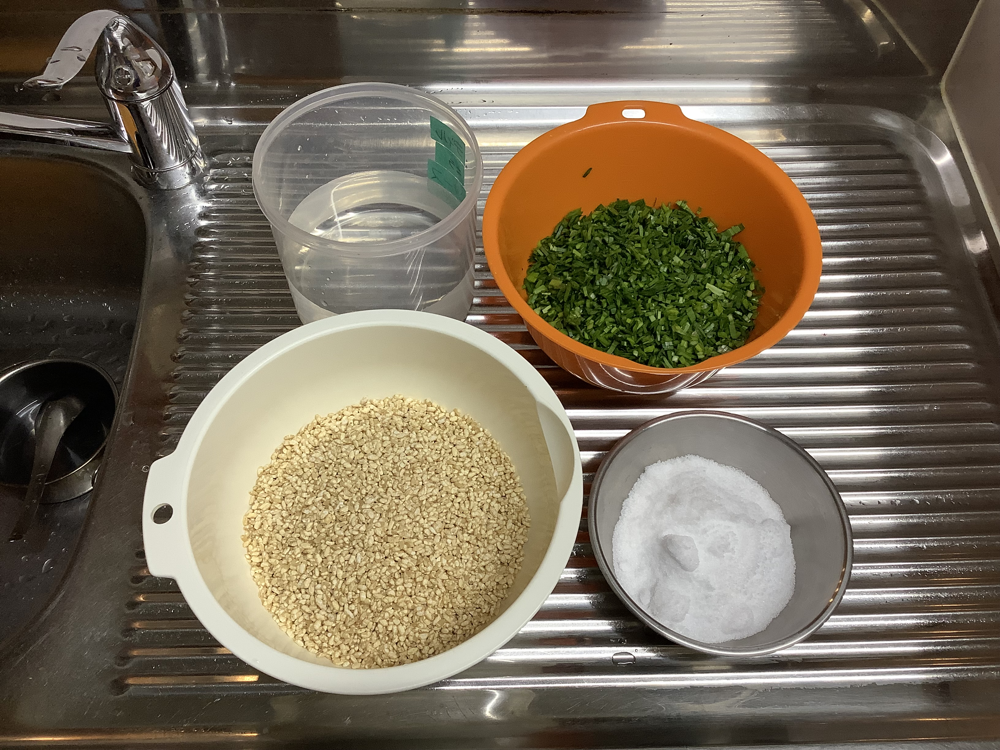
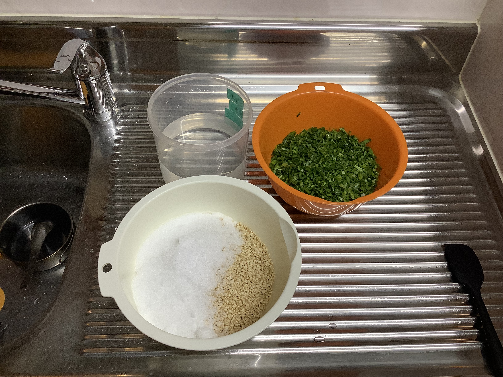
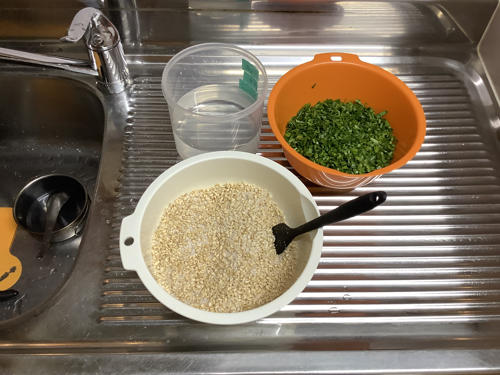
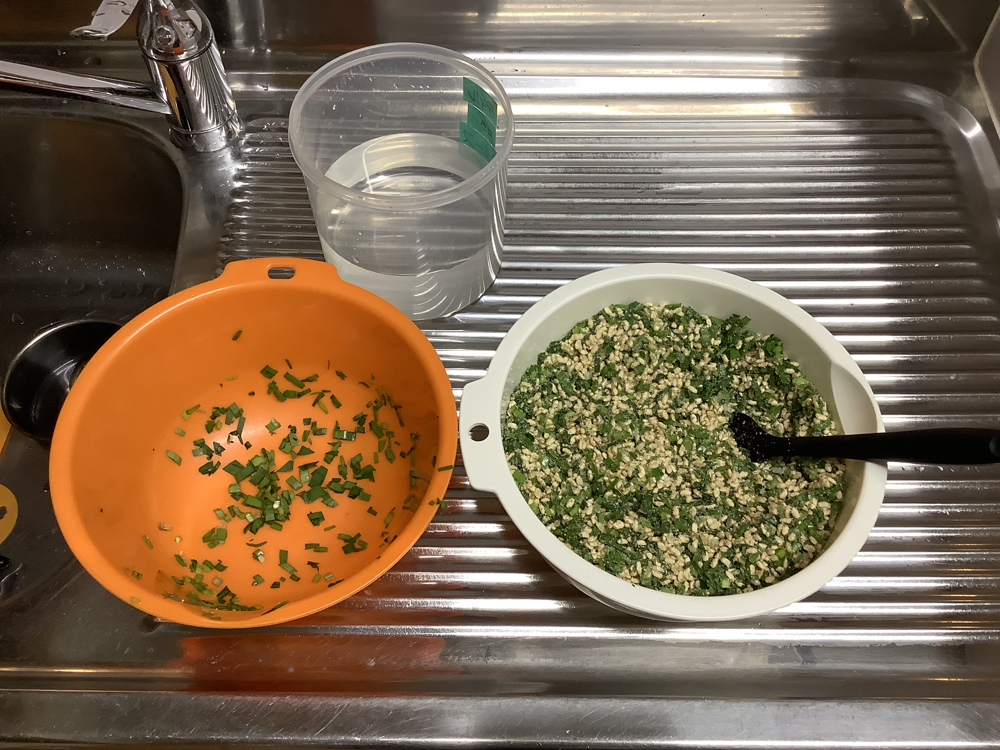
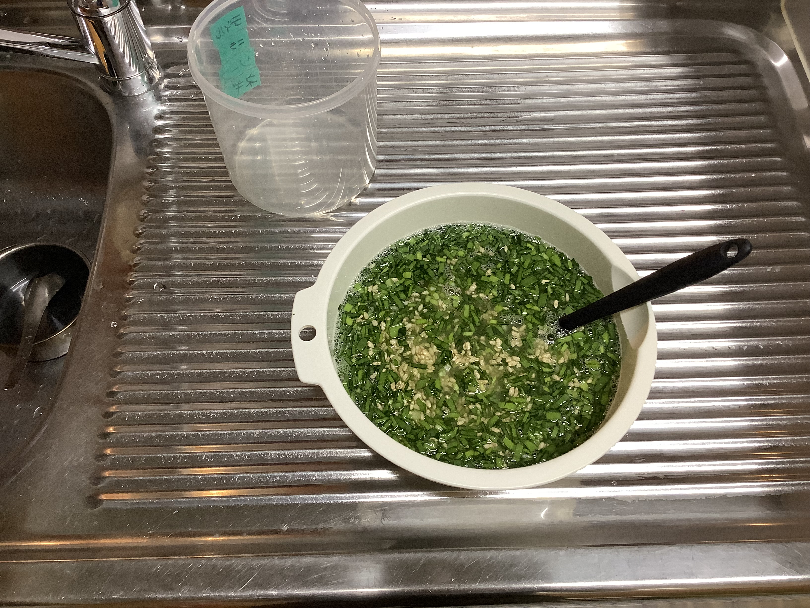
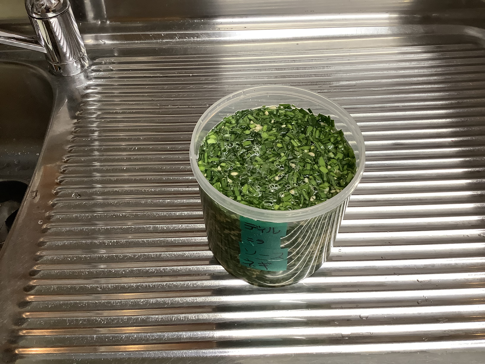
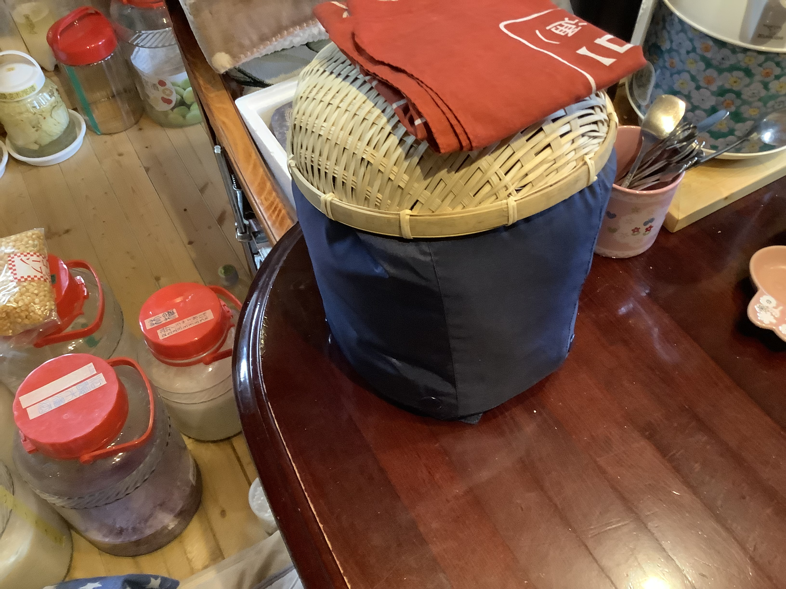
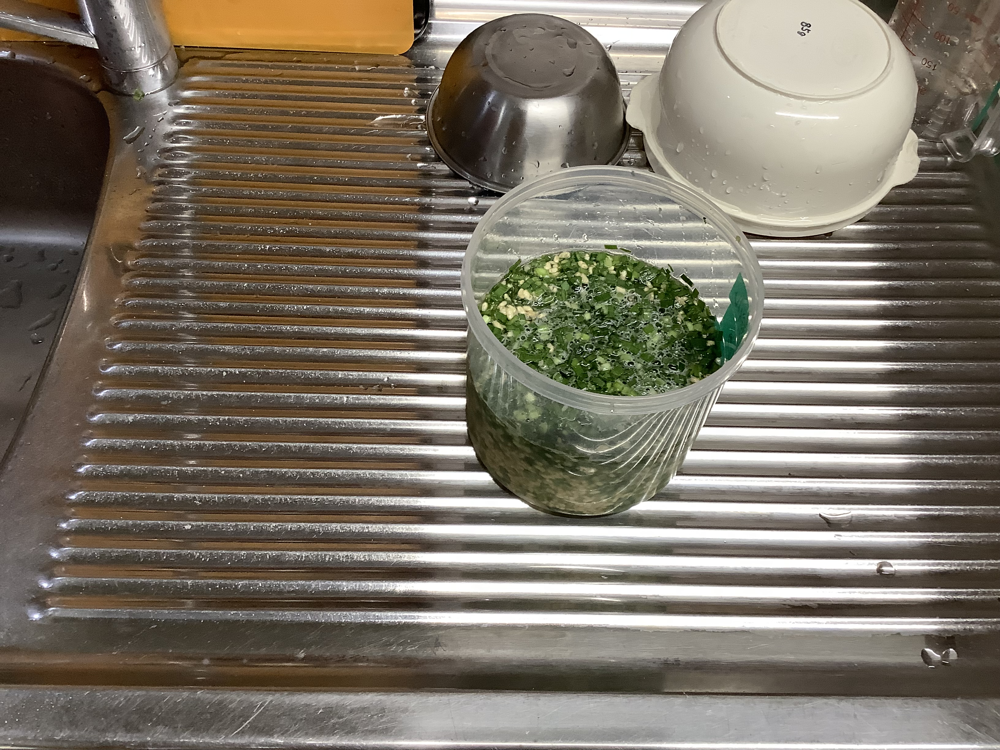
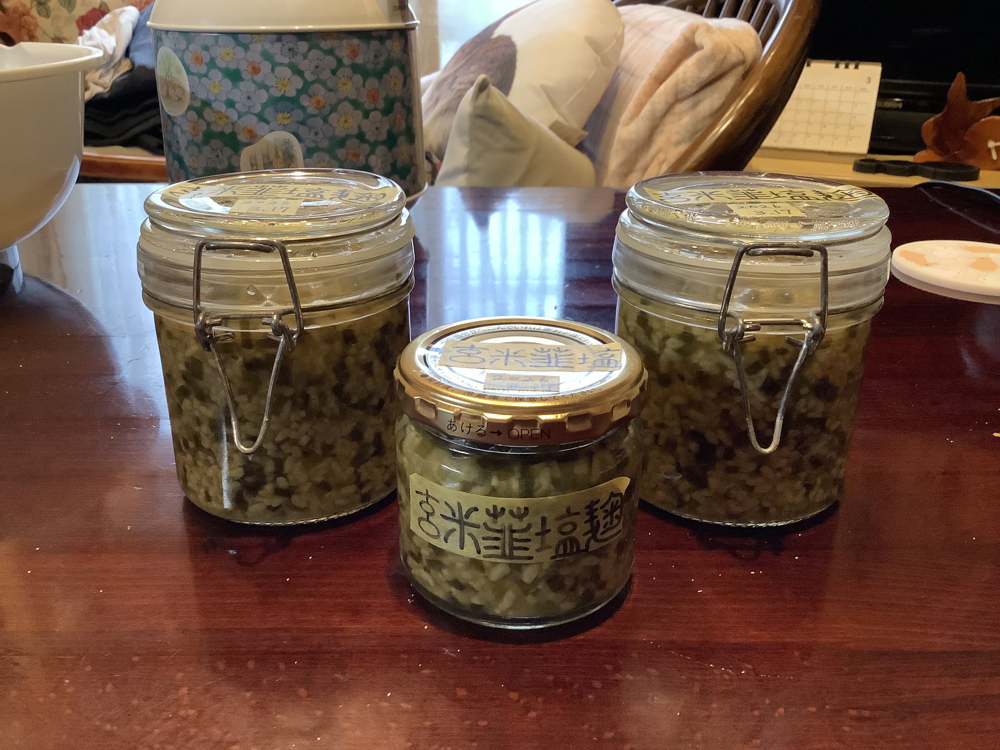

# にら塩麹（にら しおこうじ）
材料を混ぜて65℃で24時間保温して脱気して保管。

### 📅 YYYY-MM-DD

##### 🥣 recipe（いい感じ👍）

##### PyKeysのREPL用ワンライナー
実行するとクリップボードにテーブルがコピーされる。

~~~python
x=190; I='にら 米麹 水 塩 合計'.split(); r=[1,2,3]; s_s=[0,0,0]; salt=0.13; import clipboard; b_r=r[0]; r_norm=[v/b_r for v in r]; s_r=sum(r_norm); liq_s=sum(v*s for v,s in zip(r_norm, s_s)); t_r=max(s_r, (s_r-liq_s)/(1-salt)); s_amt=max(0, t_r-s_r); act_s=(liq_s+s_amt)/t_r; R=r_norm+[s_amt, t_r]; N=[f'塩分:{round(s*100,1)}%' if s != 0 else '' for s in s_s]+[f'塩分:100%']+[f'全体塩分:{round(act_s*100,1)}%']; res="|材料|割合|分量|%|備考|\n|:-:|:-:|:-:|:-:|:-:|\n"+"\n".join(f"|**{n}**|{round(v*b_r,2) if i<len(r) else round(v,2)}|{round(x*v,1)}{'ml' if n in['水','醤油','酒'] else 'g'}|{round(v/t_r*100,1)}%|{note}|" for i,(n,v,note) in enumerate(zip(I,R,N))); clipboard.set(res)
~~~

##### 📝 コメント

---

### 📅 2026-03-28 玄米にら塩麹（つるじい）

##### 🥣 recipe（いい感じ👍）

|      材料      | 割合  |   分量    |   %    |    備考    |
| :----------: | :-: | :-----: | :----: | :------: |
| **にら（つるじい）** | 1.0 | 190.0g  | 14.5%  |          |
|   **玄米麹**    | 2.0 | 380.0g  | 29.0%  |          |
|    **水**     | 3.0 | 570.0ml | 43.5%  |          |
|    **塩**     | 0.9 | 170.3g  | 13.0%  |          |
|    **合計**    | 6.9 | 1310.3g | 100.0% | 塩分:13.0% |

##### PyKeysのREPL用ワンライナー
実行するとクリップボードにテーブルがコピーされる。

~~~python
x=190; I='にら 玄米麹 水 塩 合計'.split(); r=[1,2,3]; s_s=0.00; salt=0.13; import clipboard; b_r=r[0]; r=[v/b_r for v in r]; s_r=sum(r); t_r=max(s_r, (s_r-r[-1]*s_s)/(1-salt)); salt_amt=max(0, t_r-s_r); actual_s=(r[-1]*s_s+salt_amt)/t_r; R=r+[salt_amt, t_r]; N=['']*(len(r)+1)+[f'塩分:{round(actual_s*100,1)}%']; res="|材料|割合|分量|%|備考|\n|:-:|:-:|:-:|:-:|:-:|\n"+"\n".join(f"|**{n}**|{round(v*b_r,2)}|{round(x*v,1)}{'ml' if n in['水','酒'] else 'g'}|{round(v/t_r*100,1)}%|{note}|" for n,v,note in zip(I,R,N)); clipboard.set(res)
~~~

##### 📝 コメント

2026-03-28 25:19:22 材料。

2026-03-28 15:19:43 米麹に塩を加える。

2026-03-28 15:20 塩きり麹。

2026-03-28 15:23 にらを加えて、混ぜ混ぜ。

2026-03-28 15:26 水を加えて混ぜ混ぜ。

2026-03-28 15:31 丸いタッパーでいい感じの量。

2026-03-28 15:30 保温開始。

---

### 📅 2026-03-23 玄米にら塩麹

##### 🥣 recipe 

|   材料    | 割合  |   分量    |   %    |    備考    |
| :-----: | :-: | :-----: | :----: | :------: |
| **にら**  |  1  |  160g   | 14.5%  |          |
| **玄米麹** |  2  |  320g   | 29.0%  |          |
|  **水**  |  3  |  480ml  | 43.5%  |          |
|  **塩**  | 0.9 | 143.4g  | 13.0%  |          |
| **合計**  | 6.9 | 1103.4g | 100.0% | 塩分:13.0% |

##### PyKeysのREPL用ワンライナー
実行するとクリップボードにテーブルがコピーされる。

~~~python
x=160; I='にら 玄米麹 水 塩 合計'.split(); r=[1,2,3]; s_s=0.00; salt=0.13; import clipboard; s_r=sum(r); t_r=max(s_r, (s_r-r[-1]*s_s)/(1-salt)); salt_amt=max(0, t_r-s_r); actual_s=(r[-1]*s_s+salt_amt)/t_r; R=r+[salt_amt, t_r]; N=['']*(len(r)+1)+[f'塩分:{round(actual_s*100,1)}%']; res="|材料|割合|分量|%|備考|\n|:-:|:-:|:-:|:-:|:-:|\n"+"\n".join(f"|**{n}**|{round(v,2)}|{round(x*v,1)}{'ml' if n in['水','酒'] else 'g'}|{round(v/t_r*100,1)}%|{note}|" for n,v,note in zip(I,R,N)); clipboard.set(res)
~~~

##### 📝 コメント

---

### 📅 2026-03-10 玄米にら塩麹

##### 🥣 recipe 

|   材料    | 割合  |   分量   |   %    |    備考    |
| :-----: | :-: | :----: | :----: | :------: |
| **にら**  |  1  |  120g  | 14.5%  |          |
| **玄米麹** |  2  |  240g  | 29.0%  |          |
|  **水**  |  3  | 360ml  | 43.5%  |          |
|  **塩**  | 0.9 | 107.6g | 13.0%  |          |
| **合計**  | 6.9 | 827.6g | 100.0% | 塩分:13.0% |

##### PyKeysのREPL用ワンライナー
実行するとクリップボードにテーブルがコピーされる。

~~~python
x=120; I='にら 玄米麹 水 塩 合計'.split(); r=[1,2,3]; s_s=0.00; salt=0.13; import clipboard; s_r=sum(r); t_r=max(s_r, (s_r-r[-1]*s_s)/(1-salt)); salt_amt=max(0, t_r-s_r); actual_s=(r[-1]*s_s+salt_amt)/t_r; R=r+[salt_amt, t_r]; N=['']*(len(r)+1)+[f'塩分:{round(actual_s*100,1)}%']; res="|材料|割合|分量|%|備考|\n|:-:|:-:|:-:|:-:|:-:|\n"+"\n".join(f"|**{n}**|{round(v,2)}|{round(x*v,1)}{'ml' if n in['水','酒'] else 'g'}|{round(v/t_r*100,1)}%|{note}|" for n,v,note in zip(I,R,N)); clipboard.set(res)
~~~

##### 📝 コメント

2026-03-14 丸タッパー（香り強め専用）

2026-03-14 12:12 保温開始🔥
2026-03-16 21:54 脱気瓶250×2と小瓶130と少々。

---
