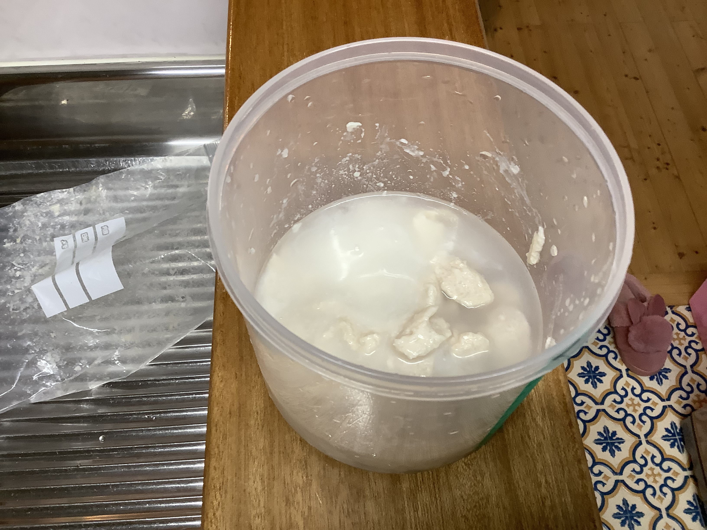
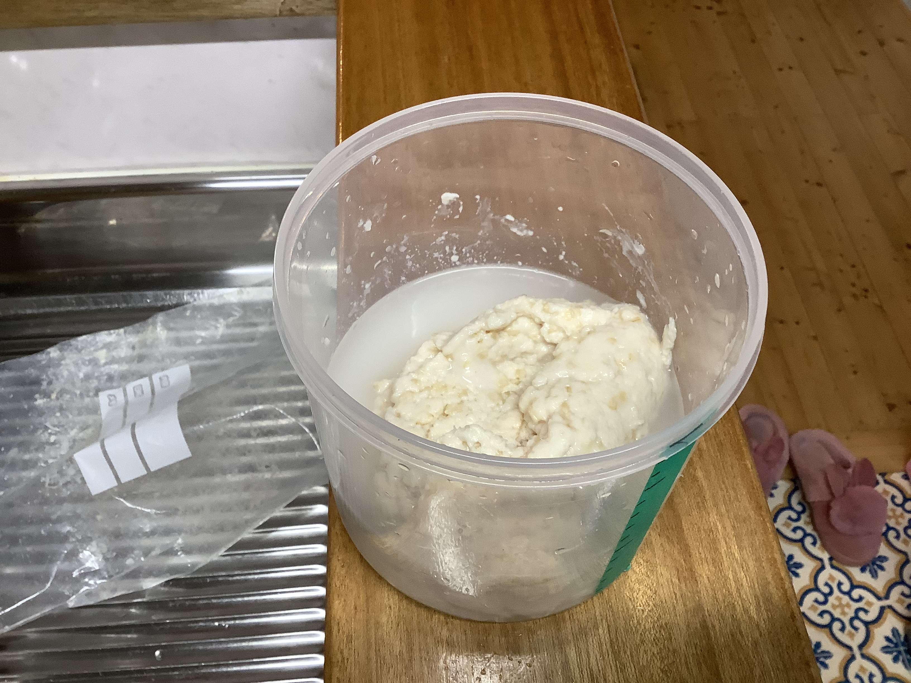
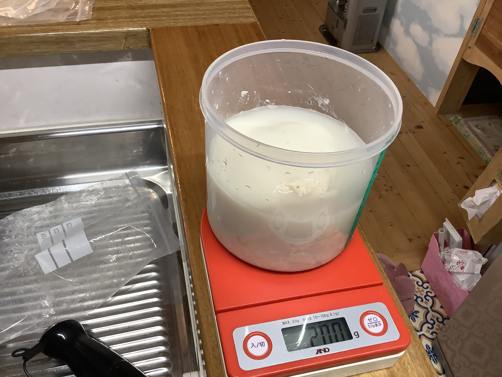
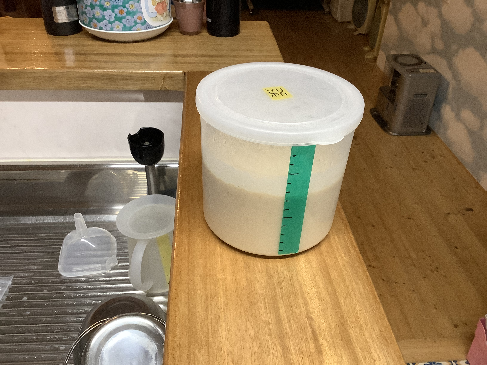

# 酒粕クリーム（さけかす くりーむ）

### 📅 2026-03-25 酒粕クリーム

##### 🥣 recipe（いい感じ👍）

|   材料    | 割合  |   分量    |   %    |   備考    |
| :-----: | :-: | :-----: | :----: | :-----: |
| **酒粕**  | 1.0 | 200.0g  | 25.0%  |         |
| **搾り粕** | 1.0 | 200.0g  | 25.0%  |         |
| **甘酒**  | 1.0 | 200.0g  | 25.0%  |         |
|  **水**  | 1.0 | 200.0ml | 25.0%  |         |
|  **塩**  |  0  |   0g    |  0.0%  |         |
| **合計**  | 4.0 | 800.0g  | 100.0% | 塩分:0.0% |

##### PyKeysのREPL用ワンライナー
実行するとクリップボードにテーブルがコピーされる。

~~~python
x=200; I='酒粕 搾り粕 甘酒 水 塩 合計'.split(); r=[1,1,1,1]; s_s=0.0; salt=0.0; import clipboard; b_r=r[0]; r=[v/b_r for v in r]; s_r=sum(r); t_r=max(s_r, (s_r-r[-1]*s_s)/(1-salt)); salt_amt=max(0, t_r-s_r); actual_s=(r[-1]*s_s+salt_amt)/t_r; R=r+[salt_amt, t_r]; N=['']*(len(r)+1)+[f'塩分:{round(actual_s*100,1)}%']; res="|材料|割合|分量|%|備考|\n|:-:|:-:|:-:|:-:|:-:|\n"+"\n".join(f"|**{n}**|{round(v*b_r,2)}|{round(x*v,1)}{'ml' if n in['水','酒'] else 'g'}|{round(v/t_r*100,1)}%|{note}|" for n,v,note in zip(I,R,N)); clipboard.set(res)
~~~

##### 📝 コメント

酒粕200gに水を加え細かくする。

どぶろくの搾り粕200gを加える。

甘酒200gを加える。

ブレンダーで滑らかになるまで撹拌する。

---

