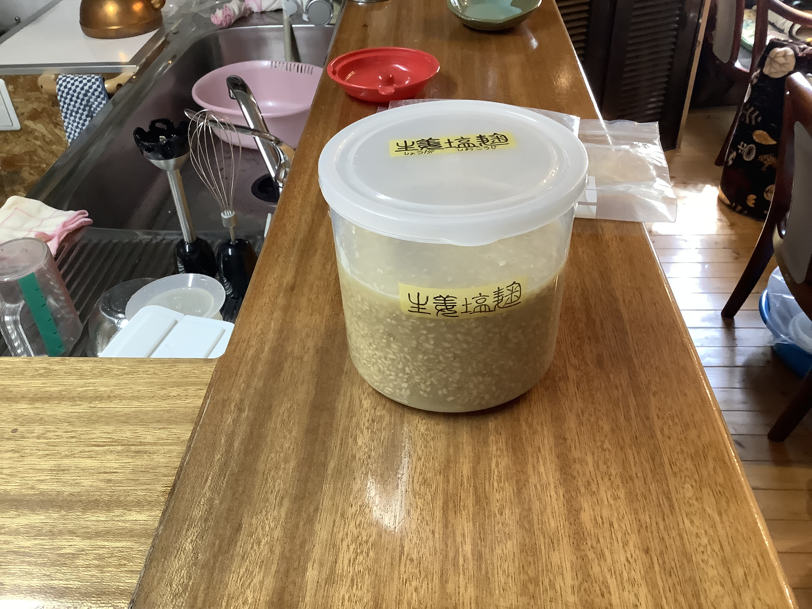
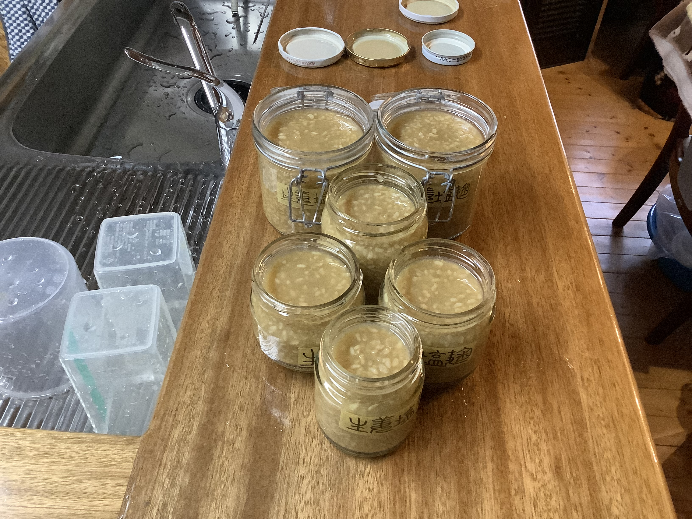
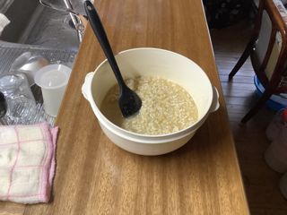
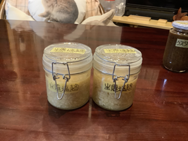
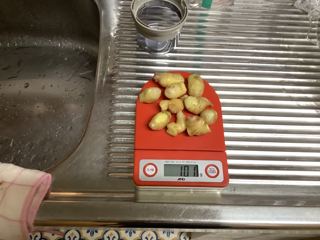
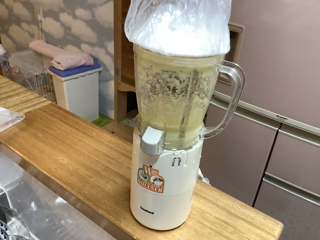
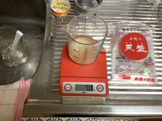
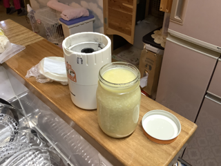
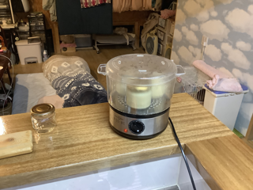
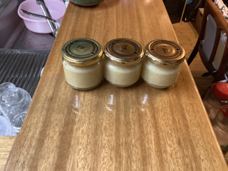

# 生姜塩麹（しょうが しおこうじ）

### 📅 YYYY-MM-DD

##### 🥣 recipe（いい感じ👍）

##### PyKeysのREPL用ワンライナー
実行するとクリップボードにテーブルがコピーされる。

~~~python
x=100; I='生姜 古古米麹 水 塩 合計'.split(); r=[1,2,1.7]; s_s=0.00; salt=0.13; import clipboard; b_r=r[0]; r=[v/b_r for v in r]; s_r=sum(r); t_r=max(s_r, (s_r-r[-1]*s_s)/(1-salt)); salt_amt=max(0, t_r-s_r); actual_s=(r[-1]*s_s+salt_amt)/t_r; R=r+[salt_amt, t_r]; N=['']*(len(r)+1)+[f'塩分:{round(actual_s*100,1)}%']; res="|材料|割合|分量|%|備考|\n|:-:|:-:|:-:|:-:|:-:|\n"+"\n".join(f"|**{n}**|{round(v*b_r,2)}|{round(x*v,1)}{'ml' if n in['水','酒'] else 'g'}|{round(v/t_r*100,1)}%|{note}|" for n,v,note in zip(I,R,N)); clipboard.set(res)
~~~

##### 📝 コメント

---

### 📅 2026-08-11 生姜塩麹

##### 🥣 recipe（いい感じ👍）

|   材料    |  割合  |   分量    |   %    |    備考    |
| :-----: | :--: | :-----: | :----: | :------: |
| **生姜**  |  1   |  200g   | 15.8%  |          |
| **玄米麹** |  2   |  400g   | 31.6%  |          |
|  **水**  | 2.5  | 500.0ml | 39.5%  |          |
|  **塩**  | 0.82 | 164.4g  | 13.0%  |          |
| **合計**  | 6.32 | 1264.4g | 100.0% | 塩分:13.0% |

##### PyKeysのREPL用ワンライナー
実行するとクリップボードにテーブルがコピーされる。

~~~python
x=200; I='生姜 玄米麹 水 塩 合計'.split(); r=[1,2,2.5]; s_s=0.00; salt=0.13; import clipboard; s_r=sum(r); t_r=max(s_r, (s_r-r[-1]*s_s)/(1-salt)); salt_amt=max(0, t_r-s_r); actual_s=(r[-1]*s_s+salt_amt)/t_r; R=r+[salt_amt, t_r]; N=['']*(len(r)+1)+[f'塩分:{round(actual_s*100,1)}%']; res="|材料|割合|分量|%|備考|\n|:-:|:-:|:-:|:-:|:-:|\n"+"\n".join(f"|**{n}**|{round(v,2)}|{round(x*v,1)}{'ml' if n in['水','酒'] else 'g'}|{round(v/t_r*100,1)}%|{note}|" for n,v,note in zip(I,R,N)); clipboard.set(res)
~~~

##### 📝 コメント

---

### 📅 2026-03-13 生姜塩麹

##### 🥣 recipe 1（水分少なめ）

|材料|割合|分量|%|備考|
|:-:|:-:|:-:|:-:|:-:|
|**生姜**|1|185g|18.5%||
|**玄米麹**|2|370g|37.0%||
|**水**|1.7|314.5ml|31.5%||
|**塩**|0.7|129.9g|13.0%||
|**合計**|5.4|999.4g|100.0%|塩分:13.0%|

##### PyKeysのREPL用ワンライナー
実行するとクリップボードにテーブルがコピーされる。

~~~python
x=185; I='生姜 玄米麹 水 塩 合計'.split(); r=[1,2,1.7]; s_s=0.00; salt=0.13; import clipboard; s_r=sum(r); t_r=max(s_r, (s_r-r[-1]*s_s)/(1-salt)); salt_amt=max(0, t_r-s_r); actual_s=(r[-1]*s_s+salt_amt)/t_r; R=r+[salt_amt, t_r]; N=['']*(len(r)+1)+[f'塩分:{round(actual_s*100,1)}%']; res="|材料|割合|分量|%|備考|\n|:-:|:-:|:-:|:-:|:-:|\n"+"\n".join(f"|**{n}**|{round(v,2)}|{round(x*v,1)}{'ml' if n in['水','酒'] else 'g'}|{round(v/t_r*100,1)}%|{note}|" for n,v,note in zip(I,R,N)); clipboard.set(res)
~~~

2026-03-17 丸タッパーで保温。

##### 🥣 recipe 2（いい感じ👍）

|材料|割合|分量|%|備考|
|:-:|:-:|:-:|:-:|:-:|
|**生姜**|1|185g|15.8%||
|**玄米麹**|2|370g|31.6%||
|**水**|2.5|462.5ml|39.5%||
|**塩**|0.82|152.0g|13.0%||
|**合計**|6.32|1169.5g|100.0%|塩分:13.0%|

##### PyKeysのREPL用ワンライナー
実行するとクリップボードにテーブルがコピーされる。

~~~python
x=185; I='生姜 玄米麹 水 塩 合計'.split(); r=[1,2,2.5]; s_s=0.00; salt=0.13; import clipboard; s_r=sum(r); t_r=max(s_r, (s_r-r[-1]*s_s)/(1-salt)); salt_amt=max(0, t_r-s_r); actual_s=(r[-1]*s_s+salt_amt)/t_r; R=r+[salt_amt, t_r]; N=['']*(len(r)+1)+[f'塩分:{round(actual_s*100,1)}%']; res="|材料|割合|分量|%|備考|\n|:-:|:-:|:-:|:-:|:-:|\n"+"\n".join(f"|**{n}**|{round(v,2)}|{round(x*v,1)}{'ml' if n in['水','酒'] else 'g'}|{round(v/t_r*100,1)}%|{note}|" for n,v,note in zip(I,R,N)); clipboard.set(res)
~~~

2026-03-18 recipe 2に変更のため不足分を追加 
水の不足分 462.5-314.5 = **148.0ml**  
塩の不足分 152.0-129.9 = **22.1g**

2026-03-19 脱気瓶いっぱい。

---

### 📅 2026-01-31 生姜塩麹

##### 🥣 recipe 2026-01-31

|   材料    | 割合  |   分量    |   %    |
| :-----: | :-: | :-----: | :----: |
| **生姜**  |  1  |  170g   | 18.5%  |
| **白米麹** |  2  |  340g   | 37.0%  |
|  **水**  | 1.7 | 289.0ml | 31.5%  |
|  **塩**  | 0.7 | 119.4g  | 13.0%  |
| **合計**  | 5.4 | 918.4g  | 100.0% |

##### PyKeysのREPL用ワンライナー
~~~python
x=170;I='生姜 白米麹 水 塩 合計'.split();r=[1,2,1.7,0.13]; Σ=sum(r[:3]);t=Σ/(1-r[3]);r.append(Σ/(1-r[3]));r[3]=t-Σ;q=[x*_ for _ in r];x,k,w,s,t=q;a,b,c,d,e=r;X,K,W,S,T=I;R=round;import clipboard;clipboard.set(f'|材料|割合|分量|%|\n|:-:|:-:|:-:|:-:|\n|**{X}**|{a}|{R(x,1)}g|{R(x/t*100,1)}%|\n|**{K}**|{b}|{R(k,1)}g|{R(k/t*100,1)}%|\n|**{W}**|{c}|{w}ml|{R(w/t*100,1)}%|\n|**{S}**|{R(d,1)}|{R(s,1)}g|{R(s/t*100,1)}%|\n|**{T}**|{R(e,1)}|{R(t,1)}g|{t/t*100}%|')
~~~

---

### 📅 2026-01-12 生姜塩麹

##### 🥣 recipe（いい感じ👍）

|材料|割合|分量|%|備考|
|:-:|:-:|:-:|:-:|:-:|
|**生姜**|2.0|170.0g|37.0%||
|**古古米麹**|1.0|85.0g|18.5%||
|**水**|1.7|144.5ml|31.5%||
|**塩**|0.7|59.5g|13.0%||
|**合計**|5.4|459.0g|100.0%|塩分:13.0%|

##### PyKeysのREPL用ワンライナー
実行するとクリップボードにテーブルがコピーされる。

~~~python
x=170; I='生姜 古古米麹 水 塩 合計'.split(); r=[2,1,1.7]; s_s=0.00; salt=0.13; import clipboard; b_r=r[0]; r=[v/b_r for v in r]; s_r=sum(r); t_r=max(s_r, (s_r-r[-1]*s_s)/(1-salt)); salt_amt=max(0, t_r-s_r); actual_s=(r[-1]*s_s+salt_amt)/t_r; R=r+[salt_amt, t_r]; N=['']*(len(r)+1)+[f'塩分:{round(actual_s*100,1)}%']; res="|材料|割合|分量|%|備考|\n|:-:|:-:|:-:|:-:|:-:|\n"+"\n".join(f"|**{n}**|{round(v*b_r,2)}|{round(x*v,1)}{'ml' if n in['水','酒'] else 'g'}|{round(v/t_r*100,1)}%|{note}|" for n,v,note in zip(I,R,N)); clipboard.set(res)
~~~

##### 📝 コメント

2026-01-12 15:19 ヨーグルトメーカー1号で55℃で保温開始。

2026-01-13 21:24 脱気瓶二つ分完成。

---

### 📅 2025-11-24 生姜塩麹

##### 🥣 recipe（いい感じ👍）

|材料|割合|分量|%|備考|
|:-:|:-:|:-:|:-:|:-:|
|**生姜**|1.0|100.0g|18.5%||
|**古古米麹**|2.0|200.0g|37.0%||
|**水**|1.7|170.0ml|31.5%||
|**塩**|0.7|70.2g|13.0%||
|**合計**|5.4|540.2g|100.0%|塩分:13.0%|

##### PyKeysのREPL用ワンライナー
実行するとクリップボードにテーブルがコピーされる。

~~~python
x=100; I='生姜 古古米麹 水 塩 合計'.split(); r=[1,2,1.7]; s_s=0.00; salt=0.13; import clipboard; b_r=r[0]; r=[v/b_r for v in r]; s_r=sum(r); t_r=max(s_r, (s_r-r[-1]*s_s)/(1-salt)); salt_amt=max(0, t_r-s_r); actual_s=(r[-1]*s_s+salt_amt)/t_r; R=r+[salt_amt, t_r]; N=['']*(len(r)+1)+[f'塩分:{round(actual_s*100,1)}%']; res="|材料|割合|分量|%|備考|\n|:-:|:-:|:-:|:-:|:-:|\n"+"\n".join(f"|**{n}**|{round(v*b_r,2)}|{round(x*v,1)}{'ml' if n in['水','酒'] else 'g'}|{round(v/t_r*100,1)}%|{note}|" for n,v,note in zip(I,R,N)); clipboard.set(res)
~~~

##### 📝 コメント

2025-11-24 17:00 べっぴん菌ちゃんねるを参考にする。
2025-11-24 17:10 生姜を洗う。

2025-11-24 16:20 水を100ml使い生姜をミキサーにかける。洗い水を残す。

2025-11-24 17:35 麹200gに生姜ペーストと洗い水塩を加え混ぜ混ぜする。

2025-11-24 17:43 とにかく混ぜ混ぜして、60℃で保温開始。

2025-11-25 08:55 かき混ぜる。塩辛い。
2025-11-25 20:46 完成。
2025-11-26 17:30 小瓶125に小分けにしスチームクッカーで30分蒸す。

2025-11-26 19:30 冷めたら常温保管。

---

