# 醤油麹（しょうゆ こうじ）


---


### 📅 2026-06-12 醤油麹

|   材料    |  比率   |   分量    |   %    |       備考        |
| :-----: | :---: | :-----: | :----: | :-------------: |
| **玄米麹** |  2.5  | 250.0g  | 28.1%  |      塩分:0%      |
| **醤油**  |  3.0  | 300.0ml | 33.7%  |    塩分:16.0%     |
|  **水**  |  3.0  | 300.0ml | 33.7%  |      塩分:0%      |
|  **塩**  | 0.411 |  41.1g  |  4.6%  |     塩分100%      |
| **砂糖**  |  0.0  |   0g    |  0.0%  |     糖分100%      |
| **合計**  | 8.911 | 891.1g  | 100.0% | 全体:10.0% / 0.0% |

| 材料   | 分量  |
| ---- | --- |
| 乾燥昆布 | 2枚  |
| 乾燥椎茸 | 2つ  |
| 鷹の爪  | 2本  |


##### PyKeysのREPL用ワンライナー
実行するとクリップボードにテーブルがコピーされる。

~~~python
x=250; salt=0.1; sugar=0.00; I='玄米麹 醤油 水 塩 砂糖 合計'.split(); r=[2.5,3,3]; s_s=[0,0.16,0]; sg_s=[0,0,0]; import clipboard; b_r=r[0]; r_norm=[v/b_r for v in r]; s_r=sum(r_norm); l_s=sum(v*s for v,s in zip(r_norm,s_s)); l_sg=sum(v*s for v,s in zip(r_norm,sg_s)); t_r=max(s_r,(s_r-l_s-l_sg)/(1-salt-sugar)); s_a=max(0,t_r*salt-l_s); sg_a=max(0,t_r*sugar-l_sg); act_s=(l_s+s_a)/t_r; act_sg=(l_sg+sg_a)/t_r; R=r_norm+[s_a,sg_a,t_r]; N=[f'塩分:{round(s*100,1)}%' for s in s_s]+['塩分100%','糖分100%',f'全体:{round(act_s*100,1)}% / {round(act_sg*100,1)}%']; res="|材料|比率|分量|%|備考|\n|:-:|:-:|:-:|:-:|:-:|\n"+"\n".join(f"|**{n}**|{round(v*b_r,3)}|{round(x*v,1)}{'ml' if n in['水','醤油'] else 'g'}|{round(v/t_r*100,1)}%|{note if i<len(N) else ''}|" for i,(n,v,note) in enumerate(zip(I,R,N))); clipboard.set(res)
~~~


##### 📝 コメント

2026-06-13 8:00
全体的に膨らんだが、粒が溶けてる様子はない。
麹に塩水を加えてから醤油を加えたからかも？


---


### 📅 2026-04-24 醤麹

|   材料    |  比率   |   分量    |   %    |       備考        |
| :-----: | :---: | :-----: | :----: | :-------------: |
| **玄米麹** |  1.0  | 300.0g  | 31.7%  |      塩分:0%      |
| **醤油**  |  1.0  | 300.0ml | 31.7%  |    塩分:16.0%     |
|  **水**  |  1.0  | 300.0ml | 31.7%  |      塩分:0%      |
|  **塩**  | 0.156 |  46.7g  |  4.9%  |     塩分100%      |
| **砂糖**  |   0   |   0g    |  0.0%  |     糖分100%      |
| **合計**  | 3.156 | 946.7g  | 100.0% | 全体:10.0% / 0.0% |


| 材料   | 分量  |
| ---- | --- |
| 乾燥昆布 | 2枚  |
| 乾燥椎茸 | 2つ  |
| 鷹の爪  | 2本  |


##### PyKeysのREPL用ワンライナー
実行するとクリップボードにテーブルがコピーされる。

~~~python
x=300; salt=0.1; sugar=0.00; I='玄米麹 醤油 水 塩 砂糖 合計'.split(); r=[1,1,1]; s_s=[0,0.16,0]; sg_s=[0,0,0]; import clipboard; b_r=r[0]; r_norm=[v/b_r for v in r]; s_r=sum(r_norm); l_s=sum(v*s for v,s in zip(r_norm,s_s)); l_sg=sum(v*s for v,s in zip(r_norm,sg_s)); t_r=max(s_r,(s_r-l_s-l_sg)/(1-salt-sugar)); s_a=max(0,t_r*salt-l_s); sg_a=max(0,t_r*sugar-l_sg); act_s=(l_s+s_a)/t_r; act_sg=(l_sg+sg_a)/t_r; R=r_norm+[s_a,sg_a,t_r]; N=[f'塩分:{round(s*100,1)}%' for s in s_s]+['塩分100%','糖分100%',f'全体:{round(act_s*100,1)}% / {round(act_sg*100,1)}%']; res="|材料|比率|分量|%|備考|\n|:-:|:-:|:-:|:-:|:-:|\n"+"\n".join(f"|**{n}**|{round(v*b_r,3)}|{round(x*v,1)}{'ml' if n in['水','醤油'] else 'g'}|{round(v/t_r*100,1)}%|{note if i<len(N) else ''}|" for i,(n,v,note) in enumerate(zip(I,R,N))); clipboard.set(res)
~~~


##### 📝 コメント

2026-04-27 醤油と塩と水を追加。
( 醤油25g + 水25g + 塩3.8g ) × 3
```25*0.15 = 3.8 (3.75)```


---


### 📅 2026-03-19 醤麹

|   材料   |  割合  |   分量    |   %    |   備考    |
| :----: | :--: | :-----: | :----: | :-----: |
| **米麹** | 1.0  | 150.0g  | 31.7%  |         |
| **水**  | 1.0  | 150.0ml | 31.7%  |         |
| **醤油** | 1.0  | 150.0g  | 31.7%  |         |
| **塩**  | 0.15 |  22.5g  |  4.8%  |         |
| **合計** | 3.15 | 472.5g  | 100.0% | 塩分:9.8% |


| 自家製米麹 | 150g |
| ----- | ---- |
| 醤油    | 400g |
| 乾燥昆布  | 一枚   |
| 乾燥椎茸  | 一つ   |
| 鷹の爪   | 一本   |

##### PyKeysのREPL用ワンライナー
実行するとクリップボードにテーブルがコピーされる。

~~~python
x=150; I='米麹 水 醤油 塩 合計'.split(); r=[1,1,1]; s_s=0.16; salt=0.0985; import clipboard; b_r=r[0]; r=[v/b_r for v in r]; s_r=sum(r); t_r=max(s_r, (s_r-r[-1]*s_s)/(1-salt)); salt_amt=max(0, t_r-s_r); actual_s=(r[-1]*s_s+salt_amt)/t_r; R=r+[salt_amt, t_r]; N=['']*(len(r)+1)+[f'塩分:{round(actual_s*100,1)}%']; res="|材料|割合|分量|%|備考|\n|:-:|:-:|:-:|:-:|:-:|\n"+"\n".join(f"|**{n}**|{round(v*b_r,2)}|{round(x*v,1)}{'ml' if n in['水','酒'] else 'g'}|{round(v/t_r*100,1)}%|{note}|" for n,v,note in zip(I,R,N)); clipboard.set(res)
~~~


---


### 📅 2026-03-03 玄米醤油麹

|       |      |
| ----- | ---- |
| 自家製米麹 | 150g |
| 醤油    | 400g |
| 乾燥昆布  | 一枚   |
| 乾燥椎茸  | 一つ   |
| 鷹の爪   | 一本   |

|   材料   | 割合  |   分量   |   %    |    備考    |
| :----: | :-: | :----: | :----: | :------: |
| **米麹** | 1.5 | 150.0g | 27.3%  |          |
| **醤油** | 4.0 | 400.0g | 72.7%  |          |
| **塩**  | 0.0 |   0g   |  0.0%  |          |
| **合計** | 5.5 | 550.0g | 100.0% | 塩分:11.6% |


##### PyKeysのREPL用ワンライナー
実行するとクリップボードにテーブルがコピーされる。

~~~python
x=150; I='米麹 醤油 塩 合計'.split(); r=[1.5,4]; s_s=0.16; salt=0.0; import clipboard; b_r=r[0]; r=[v/b_r for v in r]; s_r=sum(r); t_r=max(s_r, (s_r-r[-1]*s_s)/(1-salt)); salt_amt=max(0, t_r-s_r); actual_s=(r[-1]*s_s+salt_amt)/t_r; R=r+[salt_amt, t_r]; N=['']*(len(r)+1)+[f'塩分:{round(actual_s*100,1)}%']; res="|材料|割合|分量|%|備考|\n|:-:|:-:|:-:|:-:|:-:|\n"+"\n".join(f"|**{n}**|{round(v*b_r,2)}|{round(x*v,1)}{'ml' if n in['水','酒'] else 'g'}|{round(v/t_r*100,1)}%|{note}|" for n,v,note in zip(I,R,N)); clipboard.set(res)
~~~


---


---
### 📅 2026-03-01 醤麹

|       |      |
| ----- | ---- |
| 自家製米麹 | 250g |
| 自家製醤  | 250g |
|       |      |
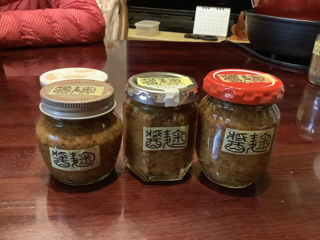


---
### 📅 2026-02-27 醤油麹

|       |      |
| ----- | ---- |
| 自家製米麹 | 150g |
| 醤油    | 400g |
| 乾燥昆布  | 一枚   |
| 乾燥椎茸  | 一つ   |
| 鷹の爪   | 一本   |
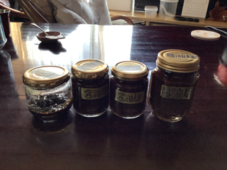


---
### 📅 2026-01-24 醤油麹

2026-01-25 18:00 

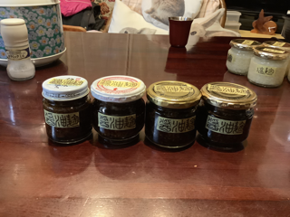


|       |           |
| ----- | --------- |
| 自家製米麹 | 100g +50g |
| 醤油    | 390g      |
| 昆布    | 一枚        |
| 椎茸    | 一つ        |
| 鷹の爪   | ミニ2本      |

---
### 📅 2025-11-16 玉ねぎ醤油麹

玉ねぎ:麹:塩（3:1:1）

|   |   |
|---|---|
|玉ねぎ|880g|
|黴米麹|293g|
|醤油|293g|

1713-833 = 880

880/3 = 293.3333333333333

2025-11-16 19:10 玉ねぎをフードプロセッサーにかける。
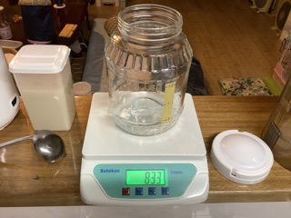

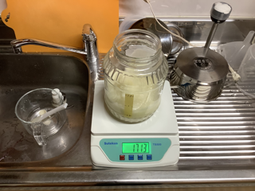


2025-11-16 19:24 黴麹300gと醤油300gを加え混ぜ混ぜ。

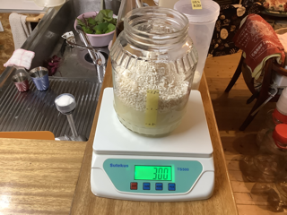

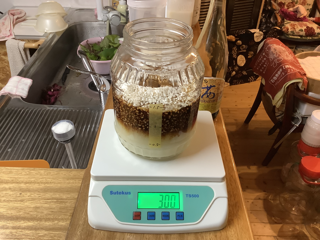

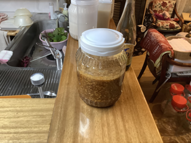


2025-11-17 08:11 保温開始。

2025-11-18 12:30 スチームクッカーで脱気する。

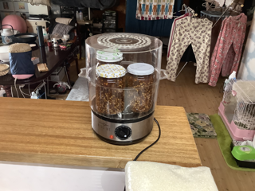

2025-11-18 13:30 完成。

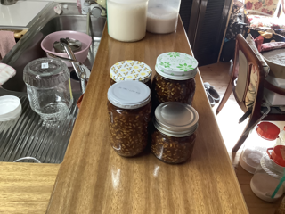


---
### 📅 2025-11-09 10:00

米麹：醤油：大根おろし（1:1:3）

|   |   |
|---|---|
|黴米麹|166g|
|醤油|166g|
|大根おろし|500g|

シンデレラ950

2025-11-09 10:00 ヨーグルトメーカーで65℃で保温開始。

2025-11-10 17:00 スチームクッカーで30分加熱。

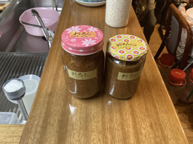


2025-11-16 21:40 中瓶360を開封。ポコッとなったので脱気成功かも。

2025-11-16 21:51 少し水分が少なめ。麹が吸った？。

---
### 📅 2025-11-07 20:38 醤油麹

|   |   |
|---|---|
|黴米麹|150g|
|醤油|340g|
|乾燥昆布|1枚|
|乾燥椎茸|1個|
|鷹の爪|1本|
|粗節|小さじ1（合計10g）|

中瓶450

2025-11-07 20:30 ヨーグルトメーカーで60℃で保温開始。

2025-11-08 19:13 完成👍。

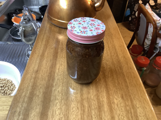


---
### 📅 2025-11-07大根おろし醤油麹

米麹：醤油：大根おろし（1:1:3）

|   |   |
|---|---|
|黴米麹|100g|
|醤油|100g|
|大根おろし|300g|

小瓶200

2025-11-07 20:00 ヨーグルトメーカーで60℃で保温開始。

2025-11-08 19:14 完成👍。

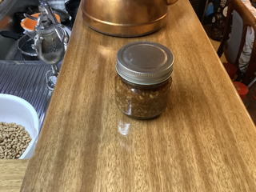


---
### 📅 2025-11-06 豆乳だし醤油麹

|   |   |
|---|---|
|黴米麹|130g|
|だし醤油|94g|
|豆乳|100g|
|醤油|60g|

中瓶400

2025-11-06 18:33 ヨーグルトメーカーで60℃で保温開始。

---
### 📅 2025-11-06 豆乳醤油麹

米麹：醤油：豆乳（1:2:1）

|   |   |
|---|---|
|黴米麹|90g|
|醤油|180g|
|豆乳|90g|

中瓶360

2025-11-06 16:04 ヨーグルトメーカーで65℃で保温開始。

---
### 📅 2025-11-05 09:30 発酵トマトだし醤油麹🍅

|   |   |
|---|---|
|黴米麹|150g|
|発酵トマトの汁🍅|100g（5%）|
|だし醤油|150g（11%）|
|醤油|80g（16%）|

2025-11-05 09:32 ヨーグルトメーカーで65℃で保温開始。

---
### 📅 2025-10-29 発酵トマトだし醤油麹🍅

|   |   |
|---|---|
|自家製米麹|150g|
|発酵トマトの汁🍅|50g（5%）|
|だし醤油|250g（11%）|

2025-10-29 12:40 ヨーグルトメーカーで65℃で保温開始。

---
### 📅 2025-10-21 トマトだし醤油麹
自家製米麹	130g
蕗の薹	50g
だし醤油	300g（11%）
ガラス瓶筒型400
(300*0.11)/(130+50+300) = 0.06875（約7%）
2025-10-21 20:40 ヨーグルトメーカーで65℃で保温開始。
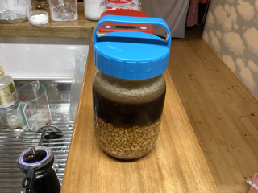


---
### 📅 2025-10-20 蕗の薹だし醤油麹

|   |   |
|---|---|
|自家製米麹|130g|
|蕗の薹|80g|
|だし醤油|260g（11%）|

中瓶450

(260*0.11)/(130+80+260) = 0.060851063829787236

塩分濃度約6%

2025-10-20 22:36 余熱。

2025-10-21 10:41 保温開始。

2025-11-07 22:20 小瓶に分け脱気保存

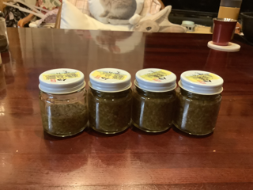


---
### 📅 2025-10-20 だし醤油麹

|   |   |
|---|---|
|自家製米麹|150g|
|だし醤油|280g|

中瓶450

2025-10-20 18:00 保温開始。

---
### 📅 2025-10-15 青唐辛子だし醤油麹🌶

|   |   |
|---|---|
|自家製米麹|150g|
|だし醤油|280g|
|青唐辛子|10g|

中瓶450。65℃で保温。

2025-10-15 00:06 唐辛子は後で追加する予定。🌶

2025-10-15 19:30 青唐辛子🌶10gを刻んで混ぜる。👍

---
### 📅 2025-10-13 茗荷だし醤油麹

|   |   |
|---|---|
|自家製米麹|150g|
|だし醤油|280g|
|茗荷|60g|

中瓶450

65℃で保温。

2025-10-14 17:18 ひつまぶし状態。うまうま旨い👍。

2025-10-29 12:50 小瓶に移す。発酵トマトの汁を足す🍅

---
### 📅 2025-10-08 10:16 唐辛子だし醤油麹🌶

|   |   |
|---|---|
|自家製米麹|150g|
|だし醤油|296g|
|唐辛子|20g|

中瓶450

---
### 📅 2025-10-05 唐辛子醤油麹🌶

|   |   |
|---|---|
|自家製米麹|150g|
|醤油|292g（16%）|
|青唐辛子|30g|

中瓶450

---
### 📅 2025-10-05 蕗の薹だし醤油麹

|   |   |
|---|---|
|自家製米麹|130g|
|蕗の薹|80g|
|だし醤油|267g|

中瓶450

蕗の薹を祈願でいると黒ずんだ部分があり傷んでいるのかと戸惑ったが、酸化してるだけで問題ないとのこと。食べたら美味しかった👍。

2025-10-09 00:30 ヨーグルトメーカーで65℃で保温。

---
### 📅 2025-10-02 唐辛子だし醤油麹🌶

|   |   |
|---|---|
|自家製米麹|150g|
|だし醤油|300g|
|唐辛子|20g|

中瓶450

2025-10-02 21:54 辛くな〜い

---
### 📅 2025-09-25 ニラ醤油麹

|   |   |
|---|---|
|自家製米麹|300g|
|ニラ|162g|
|醤油|300g|

2025-09-28 20:30 うまうま旨い👍。775g

小瓶150g×4

小瓶120g

小皿15g

---
### 📅 2025-08-23 玉ねぎ醤油麹🧅

玉ねぎ:麹:塩（3:1:1）

|   |   |
|---|---|
|玉ねぎ|558g|
|自家製米麹|186g|
|醤油|186g|

醤油がないので後で入れる。

2025-09-20 15:50 保温開始。👍

2025-09-22 00:04 うん、旨い👍

---
### 📅 2025-09-20 12:26 唐辛子だし醤油麹🌶

|   |   |
|---|---|
|自家製米麹|150g|
|だし醤油|300g|
|唐辛子|3本（12g）|

2025-09-20 12:29 ヨーグルトメーカーで60℃で保温開始。

---
### 📅 2025-09-20 12:26 唐辛子醤油麹🌶

|   |   |
|---|---|
|自家製米麹|150g|
|醤油|295g|
|唐辛子|5本（15g）|

2025-09-20 12:29 ヨーグルトメーカーで60℃で保温開始。

2025-09-22 00:03 思ったほど辛くない。旨い👍

---
### 📅 2025-09-16 18:30 唐辛子だし醤油麹🌶

|   |   |
|---|---|
|自家製米麹|150g|
|だし醤油|300g|
|唐辛子|5本（12g）|

2025-09-16 18:53 保温開始。

---
### 📅 2025-09-09 唐辛子醤油麹🌶

|   |   |
|---|---|
|自家製米麹|150g|
|醤油|300g|
|唐辛子|3本|
|昆布|5g|
|椎茸|3g|
|粗節|5g|

中瓶450

2025-09-09 16:42 ヨーグルトメーカー60℃で保温開始。

---
### 📅 2025-09-01 ニラ醤油麹

|   |   |
|---|---|
|自家製米麹|300g|
|ニラ|312g|
|醤油|300g|

2025-09-01 10:59 醤油がないので冷蔵庫へ

2025-09-01 20:00 醤油を加える。

2025-09-02 00:10 保温器で保温。 

2025-09-02 06:08 しんなりしてきたので混ぜる。常温保温。

2025-09-02 10:14 いい塩梅👍。保温器保温。

2025-09-02 23:00 いい塩梅👍。

2025-09-03 05:03 ガラス小瓶に110gお裾分け。

2025-09-03 05:04 冷蔵庫へ。

2025-09-05 18:19 瓶詰め

150g×3

100g


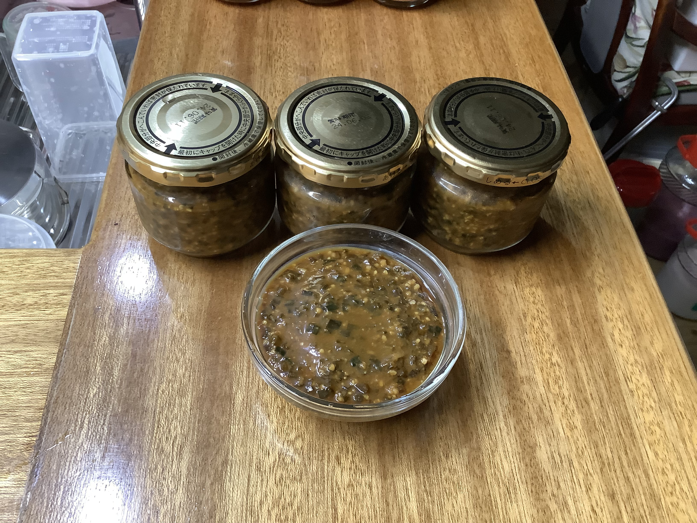


---
### 📅 2025-08-27 11:59 

|   |   |
|---|---|
|自家製米麹|150g|
|だし醤油|340g|

中瓶450

  

---
### 📅 2025-08-27 11:57 

|       |           |
| ----- | --------- |
| 自家製米麹 | 150g      |
| 醤油    | 320g      |
| 昆布    | 二枚        |
| 椎茸    | 二つ        |
| 粗節    | 大きいスプーン1杯 |
| 青唐辛子  | 2本        |

中瓶450

---
### 📅 2025-08-23 玉ねぎ醤油麹🧅

玉ねぎ:麹:塩（3:1:1）

|   |   |
|---|---|
|玉ねぎ|875g|
|自家製米麹|291g|
|醤油|291g|

丸タッパーの限界。

2025-08-23 20:00 保温開始。

2025-08-24 11:56 旨い👍

  

中瓶500g

中瓶360g

中瓶347g

---
### 📅 2025-08-15

だし醤油麹

|   |   |
|---|---|
|自家製米麹|150g|
|だし醤油|350g|

中瓶450

  

醤油麹

|   |   |
|---|---|
|自家製米麹|150g|
|醤油|300g|
|昆布|二枚|
|椎茸|二つ|
|粗節|小さじ二杯|

中瓶450

---
### 📅 2025-07-27 だし醤油麹

|   |   |   |
|---|---|---|
|自家製米麹|150g||
|だし醤油|350g||

中瓶450

---
### 📅 2025-07-28 醤油麹

|   |   |   |
|---|---|---|
|自家製米麹|127g||
|醤油|250g||
|昆布|一枚||
|椎茸|一つ||
|粗節|少々||

中瓶370

  

  

中瓶300 醤油麹

|   |   |   |
|---|---|---|
|自家製米麹|90g||
|醤油|230g||
|昆布|一枚||
|椎茸|一つ||
|粗節|少々||

中瓶300

---
### 📅 2025-07-22 だし醤油麹

|   |   |   |
|---|---|---|
|自家製米麹|150g||
|だし醤油|350g||

中瓶450

  

  

---
### 📅 2025-07-15 玉ねぎ醤油麹

|   |   |   |
|---|---|---|
|自家製米麹|127g||
|醤油|121g||
|玉ねぎ|330g||

丸いタッパー1350

2025-07-15 11:45 保温器で保温

2025-07-16 08:55 580g

---
### 📅 2025-07-11 醤油麹

|   |   |   |
|---|---|---|
|自家製米麹|90g||
|醤油|230g||
|昆布|一枚||
|椎茸|一つ||
|粗節|少々||

中瓶300

  

---
### 📅 2025-07-11 だし醤油麹

|   |   |   |
|---|---|---|
|自家製米麹|150g||
|だし醤油|350g||

中瓶450

---
### 📅 2025-07-04 だし醤油麹

|   |   |   |
|---|---|---|
|自家製米麹|150g||
|醤油|350g||

---
### 📅 2025-06-25 玉ねぎ醤油麹

|       |      |                    |
| ----- | ---- | ------------------ |
| 自家製米麹 | 276g |                    |
| 醤油    | 276g | 800/720*276 = 307円 |
| 玉ねぎ   | 830g | 100円               |

丸いタッパー1350

2025-06-25 16:37 保温器で保温

---
### 📅 2025-06-24 だし醤油麹

|   |   |
|---|---|
|自家製米麹|150|
|だし醤油|350|

ガラス瓶450

---
### 📅 2025-06-18 醤油麹

|   |   |
|---|---|
|自家製米麹|150|
|醤油|350|

ガラス瓶450

2025-06-18 14:00 ヨーグルトメーカーで保温

---
### 📅 2025-06-17 14:28 玉ねぎ醤油麹

|   |   |
|---|---|
|自家製米麹|90g|
|醤油|90g|
|玉ねぎ|270g|

中瓶450赤

|   |   |
|---|---|
|自家製米麹|80g|
|醤油|85g|
|玉ねぎ|240g|

中瓶450緑

2025-06-17 14:00 保温開始

---
### 📅 2025-06-10 だし醤油麹

|   |   |
|---|---|
|自家製米麹|370*0.3 = 111.0|
|だし醤油|370*0.7 = 259.0|

ガラス瓶370

---
### 📅 2025-06-03ねぎ醤油麹

|   |   |
|---|---|
|自家製米麹|150g|
|ねぎ|150g|
|醤油|158g|

中瓶450

ヨーグルトメーカー 60℃

2025-06-03 17:00 保温開始

---
### 📅 2025-06-02 だし醤油麹

|   |   |
|---|---|
|自家製米麹|150g|
|だし醤油|300g|

ガラス瓶450 花柄

---
### 📅 2025-05-30 ニラだし醤油麹

|   |   |
|---|---|
|自家製米麹|75g|
|にら|150g|
|だし醤油|150g|

丸いタッパー1350

---
### 📅 2025-05-30 ニラ醤油麹

|   |   |
|---|---|
|自家製米麹|225g|
|にら|230g|
|醤油|225g|

丸いタッパー1350

---
### 📅 2025-05-30 醤油麹

|   |   |
|---|---|
|自家製米麹|118g|
|醤油|275g|

中瓶370ギリ

---
### 📅 2025-05-26 ニラ醤油麹

|   |   |
|---|---|
|自家製米麹|150g|
|にら|150g|
|だし醤油|150g|

汁気が全然たらん感じ。

丸いタッパー1350

2025-05-26 14:00 保温開始。

2025-05-27 14:00 完成。

中瓶370にすりきりと少々。

---
### 📅 2025-05-16 醤油

|   |   |
|---|---|
|自家製米麹|200*.3 = 60.0|
|醤油|200*.7 = 140.0|

小瓶200

---
### 📅 2025-05-15 だし醤油麹

|   |   |
|---|---|
|自家製米麹|150g|
|だし醤油|300g|

ガラス瓶450 花柄

---
### 📅 2025-05-06 だし醤油麹

自家製米麹	100g
会津麹	50g
だし醤油	220g
ガラス瓶370 柄
保温器で保温。

---
### 📅 2025-04-25 だし醤油麹

|   |   |
|---|---|
|自家製米麹|150g|
|だし醤油|300g|

ガラス瓶450 柄

---
### 📅 2025-04-18 だし醤油麹

|   |   |
|---|---|
|自家製米麹|150g|
|だし醤油|300g|

ガラス瓶450 柄

---
### 📅 2025-04-18南蛮醤油麹

|   |   |
|---|---|
|自家製米麹|150g|
|南蛮醤油|183g|
|だし醤油|117g|

ガラス瓶450 シルバー

---
### 📅 2025-04-11 出汁醤油麹

|   |   |
|---|---|
|自家製米麹|130g|
|だし醤油|230g|

2025-04-11 17:30 保温開始

---
### 📅 2025-04-04 蕗だし醤油麹

|   |   |
|---|---|
|蕗の薹|97g|
|自家製米麹|150g|
|だし醤油|114g|

2025-04-04 19:30 保温開始

2025-04-04 21:40 膨張し吹き溢れる。

---
### 📅 2025-04-04 出汁醤油麹

|   |   |
|---|---|
|自家製米麹|120g|
|だし醤油|230g|

2025-04-04 19:30 保温開始

2025-04-04 21:40 吹き溢れなし。


---
### 📅 2025-03-31 出汁醤油麹

|   |   |
|---|---|
|自家製べちゃ麹|200g|
|出汁醤油|瓶のふちまで|

---
### 📅 2025-03-31 南蛮醤油麹

|   |   |
|---|---|
|自家製べちゃ麹|150g|
|南蛮醤油|瓶のふちまで|

---
### 📅 2025-03-29 蕗の薹出汁醤油麹

|      |     |
| ---- | --- |
| 蕗の薹  | 45g |
| 乾燥米麹 | 45g |
| 出汁醤油 | 53g |

2025-03-29 19:04 保温開始

---

### 📅 2025-03-28 16:00

だし醤油 中瓶390

|   |   |
|---|---|
|乾燥米麹（会津）|117|
|だし醤油|273|

南蛮醤油粕 中瓶300

|         |     |
| ------- | --- |
| 生米麹（宮城） | 90  |
| 南蛮醤油粕   | 210 |

60℃で24時間保温する。

だし醤油

|   |   |
|---|---|
|乾燥米麹（会津）|90g|
|だし醤油|210g|

南蛮醤油粕

|   |   |
|---|---|
|生米麹（宮城）|90g|
|南蛮醤油粕|210g|

60℃で24時間保温する。

---
### 📅2025-03-12 08:00

だし醤油

|   |   |
|---|---|
|生米麹|90g|
|だし醤油|210g|

|   |   |
|---|---|
|生米麹|36g|
|だし醤油|84g|

南蛮醤油粕

|   |   |
|---|---|
|生米麹|36g|
|南蛮醤油粕|84g|
60℃で24時間保温する。


---
### 📅 南蛮醤油 2025-03-10 08:00 🤗
生米麹	90g
南蛮醤油	210g
60℃で24時間保温する。


---
 
 ### 📅 2025-03-05 だし醤油 300g 🤗

|   |   |
|---|---|
|乾燥米麹|75+15g|
|だし醤油|175+35g|

瓶の容量に余裕があったので全体で300gになるように調整した。

2025-03-05 20:00  保温開始。保温器のスイッチを入れ忘れてた。

2025-03-06 20:00 スプーンで潰すようにかき混ぜて完成。

  

*仕上げは手でかき混ぜて潰す程度が美味しい。


---
### 📅 2025-02-27

南蛮醤油 300g

|   |   |
|---|---|
|乾燥米麹|90g|
|南蛮醤油|210g|

ミルサーで粉砕した米麹に南蛮醤油を加え攪拌する。
おまけ

|   |   |
|---|---|
|乾燥米麹|22g|
|南蛮醤油|50g|

ミルサーで塩麹と南蛮醤油を種ごと粉砕及び撹拌する。

100g = 30g + 70g

120g = 36g + 84g

250g = 75g + 175g

300g = 90g + 210g

---
### 📅 2025-02-21 18:00

乾燥米麹 : 醤油（重量比）

3 : 7

  

たまり醤油 120g

|   |   |
|---|---|
|乾燥米麹|36g|
|たまり醤油|84g|


だし醤油 250g

|   |   |
|---|---|
|乾燥米麹|45g + 30g|
|だし醤油|175g|


南蛮醤油 120g

|   |   |
|---|---|
|乾燥米麹|36g|
|南蛮醤油|84g|


1. 保存容器を熱湯消毒する。
2. 消毒した保存容器に乾燥米麹を入れる。
3. それぞれの醤油を入れる。
4. 60℃で保温する。
5. 24時間保温し完成。
6. 軽く潰して召し上がれ。

- だし醤油の麹の分量を間違えたので追加する。

---
### 📅 2025-02-15 13:23

醤油麹

1. 麹と醤油を容器に入れる。50:50

2025-02-15 13:23 3追加まとめて保温開始

2025-02-15 15:43 

下敷きタオルを二つ折りで品温約 50.0℃

醤油麹が水分を吸われてパラパラな感じ

2025-02-15 20:00 醤油麹に20mlの水を加える。

2025-02-15 23:00 ヒーターのスイッチを切る。

伊予柑麹、トマト塩麹、醤油麹、それぞれが耐火パテのような固さになる。

  

次回は水分量を調整して柔らかく仕上げたい。

乾燥米麹:醤油は34:65でやってみようと思う。

---


