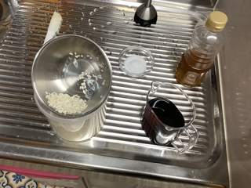
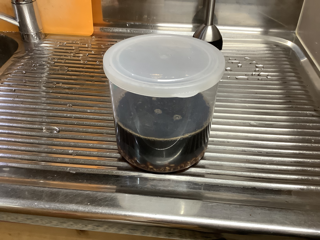
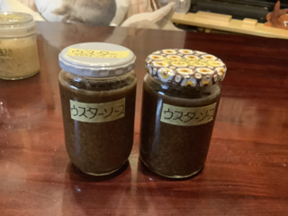

# ウスターソース麹（うすたーそーす こうじ）

### 📅 YYYY-MM-DD

##### 🥣 recipe（いい感じ👍）

##### PyKeysのREPL用ワンライナー
実行するとクリップボードにテーブルがコピーされる。

~~~python
x=270; I='ウスターソース 米麹 水 塩 合計'.split(); r=[3,1,1]; s_s=[0.04,0,0]; salt=0.0347; import clipboard; b_r=r[0]; r_norm=[v/b_r for v in r]; s_r=sum(r_norm); liq_s=sum(v*s for v,s in zip(r_norm, s_s)); t_r=max(s_r, (s_r-liq_s)/(1-salt)); s_amt=max(0, t_r-s_r); act_s=(liq_s+s_amt)/t_r; R=r_norm+[s_amt, t_r]; N=[f'塩分:{round(s*100,1)}%' if s != 0 else '' for s in s_s]+[f'塩分:100%']+[f'全体塩分:{round(act_s*100,1)}%']; res="|材料|割合|分量|%|備考|\n|:-:|:-:|:-:|:-:|:-:|\n"+"\n".join(f"|**{n}**|{round(v*b_r,2) if i<len(r) else round(v,2)}|{round(x*v,1)}{'ml' if n in['水','醤油','酒'] else 'g'}|{round(v/t_r*100,1)}%|{note}|" for i,(n,v,note) in enumerate(zip(I,R,N))); clipboard.set(res)
~~~

##### 📝 コメント

---

### 📅 2026-02-10 トンカツソース麹

##### 🥣 recipe（いい感じ👍）

|材料|割合|分量|%|備考|
|:-:|:-:|:-:|:-:|:-:|
|**ウスターソース**|3.0|270.0g|59.3%|塩分:4.0%|
|**米麹**|1.0|90.0g|19.8%||
|**水**|1.0|90.0ml|19.8%||
|**塩**|0.02|5.0g|1.1%|塩分:100%|
|**合計**|1.69|455.0g|100.0%|全体塩分:3.5%|

##### PyKeysのREPL用ワンライナー
実行するとクリップボードにテーブルがコピーされる。

~~~python
x=270; I='トンカツソース 米麹 水 塩 合計'.split(); r=[3,1,1]; s_s=[0.04,0,0]; salt=0.0347; import clipboard; b_r=r[0]; r_norm=[v/b_r for v in r]; s_r=sum(r_norm); liq_s=sum(v*s for v,s in zip(r_norm, s_s)); t_r=max(s_r, (s_r-liq_s)/(1-salt)); s_amt=max(0, t_r-s_r); act_s=(liq_s+s_amt)/t_r; R=r_norm+[s_amt, t_r]; N=[f'塩分:{round(s*100,1)}%' if s != 0 else '' for s in s_s]+[f'塩分:100%']+[f'全体塩分:{round(act_s*100,1)}%']; res="|材料|割合|分量|%|備考|\n|:-:|:-:|:-:|:-:|:-:|\n"+"\n".join(f"|**{n}**|{round(v*b_r,2) if i<len(r) else round(v,2)}|{round(x*v,1)}{'ml' if n in['水','醤油','酒'] else 'g'}|{round(v/t_r*100,1)}%|{note}|" for i,(n,v,note) in enumerate(zip(I,R,N))); clipboard.set(res)
~~~

##### 📝 コメント

ガラス瓶500で8分目。

2026-02-10 15:14 保温開始。

2026-02-11 16:36 完成。柔らかく膨らんでドロドロ

---

### 📅 2026-01-12 ウスターソース塩麹

##### 🥣 recipe（いい感じ👍）

|材料|割合|分量|%|備考|
|:-:|:-:|:-:|:-:|:-:|
|**米麹**|1.0|150.0g|21.5%||
|**水**|1.5|225.0ml|32.3%||
|**ウスターソース**|2.0|300.0g|43.0%||
|**塩**|0.15|22.5g|3.2%||
|**合計**|4.65|697.5g|100.0%|塩分:5.8%|
##### PyKeysのREPL用ワンライナー
実行するとクリップボードにテーブルがコピーされる。

~~~python
x=150; I='米麹 水 ウスターソース 塩 合計'.split(); r=[1,1.5,2]; s_s=0.06; salt=0.058; import clipboard; b_r=r[0]; r=[v/b_r for v in r]; s_r=sum(r); t_r=max(s_r, (s_r-r[-1]*s_s)/(1-salt)); salt_amt=max(0, t_r-s_r); actual_s=(r[-1]*s_s+salt_amt)/t_r; R=r+[salt_amt, t_r]; N=['']*(len(r)+1)+[f'塩分:{round(actual_s*100,1)}%']; res="|材料|割合|分量|%|備考|\n|:-:|:-:|:-:|:-:|:-:|\n"+"\n".join(f"|**{n}**|{round(v*b_r,2)}|{round(x*v,1)}{'ml' if n in['水','酒'] else 'g'}|{round(v/t_r*100,1)}%|{note}|" for n,v,note in zip(I,R,N)); clipboard.set(res)
~~~

##### 📝 コメント

2026-01-12 15:20 材料を混ぜるだけ。

香りが強いのでディルで使ったタッパーを使用。

2026-01-14 21:25 中瓶２つできました。

---

