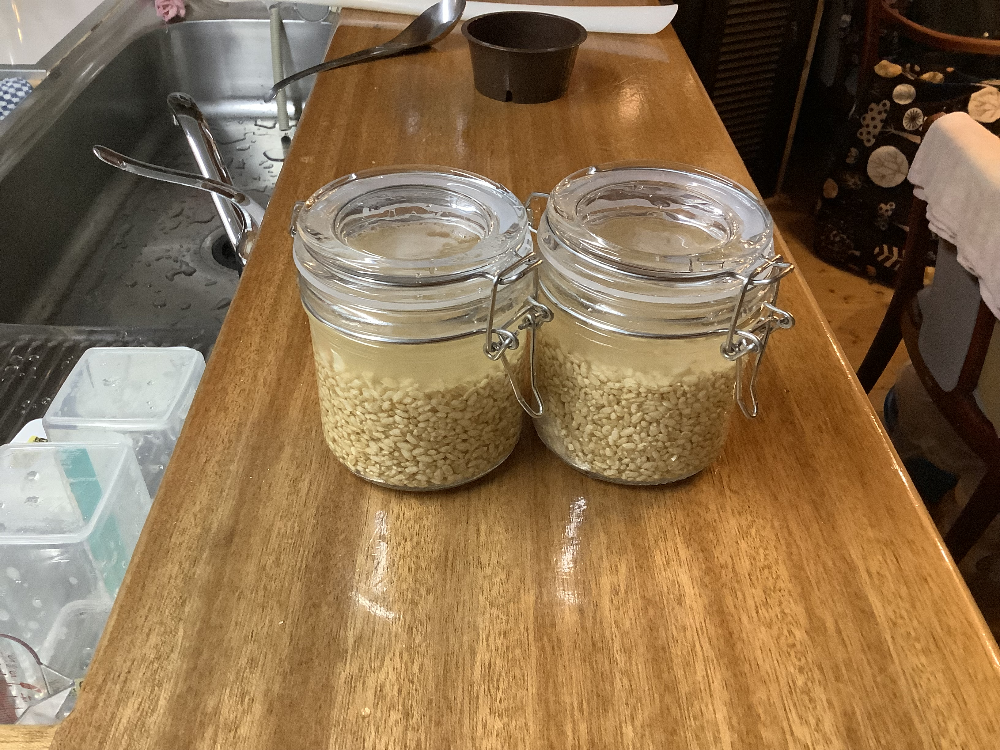

---
aliases:
---
# 塩麹
**塩麹（しおこうじ）** は、米麹、塩、水を混ぜて発酵・熟成させた日本の伝統的な調味料です。

古くから東北地方などで野菜の漬け床として利用されてきましたが、2010年頃からその万能性が再注目され、和食に限らず幅広い料理に使われるようになりました。

### 主な特徴と効果

- **旨味を引き出す:** 麹菌が持つ酵素（プロテアーゼ）が肉や魚のタンパク質を分解し、旨味成分であるアミノ酸に変えます。
    
- **食材を柔らかくする:** 酵素の働きで組織がほぐれるため、安い赤身肉や鶏胸肉なども驚くほどしっとり、柔らかく仕上がります。
    
- **素材の甘みを強調:** 炭水化物を分解して糖に変える酵素（アミラーゼ）も含まれているため、野菜などの甘みも引き立ちます。
    
- **整腸作用:** 発酵食品であるため、腸内環境を整える効果も期待されています。
    

### 基本の使い方

一般的には**「食材の重さの10%」**程度の塩麹に漬け込むのが適量とされています。

- **漬ける:** 肉や魚を30分〜一晩ほど漬けてから焼く。
    
- **和える:** 茹で野菜や生のキュウリなどと和えて浅漬けにする。
    
- **隠し味:** スープやパスタソースに少量加えると、塩味だけでなく深みのあるコクが出ます。
    
### 作り方

#### 基本レシピ

材料を混ぜて65℃で24時間保温しスチームクッカーで脱気して保管。

|   材料   |  割合  |   分量    |   %    |
| :----: | :--: | :-----: | :----: |
| 麹  |  1   |  100g   | 34.8%  |
| 水  | 1.5  | 150.0ml | 52.2%  |
| 塩  | 0.37 |  37.4g  | 13.0%  |
| 合計 | 2.87 | 287.4g  | 100.0% |

##### PyKeysのREPL用ワンライナー
実行するとクリップボードにテーブルがコピーされる。
~~~python
x=100; I='麹 水 塩 合計'.split(); r=[1,1.5]; s_s=0.0; salt=0.13; import clipboard; s_r=sum(r); t_r=(s_r-r[-1]*s_s)/(1-salt); R=r+[t_r-s_r,t_r]; res="|材料|割合|分量|%|\n|:-:|:-:|:-:|:-:|\n"+"\n".join(f"|**{n}**|{round(v,2)}|{round(x*v,1)}{'ml' if n in['水','醤油','酒'] else 'g'}|{round(v/t_r*100,1)}%|" for n,v in zip(I,R)); clipboard.set(res)
~~~

---

### 📅 2026-03-08 玄米塩麹

##### 🥣 recipe（いい感じ👍）

|材料|割合|分量|%|
|:-:|:-:|:-:|:-:|
|**玄米麹**|1|100g|34.8%|
|**水**|1.5|150.0ml|52.2%|
|**塩**|0.37|37.4g|13.0%|
|**合計**|2.87|287.4g|100.0%|

##### PyKeysのREPL用ワンライナー
実行するとクリップボードにテーブルがコピーされる。

~~~python
x=100; I='玄米麹 水 塩 合計'.split(); r=[1,1.5]; salt=0.13; import clipboard; s_r=sum(r); t_r=s_r/(1-salt); R=r+[t_r-s_r,t_r]; res="|材料|割合|分量|%|\n|:-:|:-:|:-:|:-:|\n"+"\n".join(f"|**{n}**|{round(v,2)}|{round(x*v,1)}{'ml' if n=='水' else 'g'}|{round(v/t_r*100,1)}%|" for n,v in zip(I,R)); clipboard.set(res)
~~~

2026-03-08 脱気瓶250×2

---

### 📅 2026-02-02 ねぎ塩麹

##### 🥣 recipe 1（水分少なめ）2026-02-02

|  *材料*   | *割合*  | *分量*  |  *%*   |
| :-----: | :---: | :---: | :----: |
| **ねぎ**  |   4   | 436g  | 50.0%  |
| **白米麹** |   2   | 218g  | 50.0%  |
|  **水**  |   1   | 109ml | 12.5%  |
|  **塩**  | 12.5% | 109g  | 12.5%  |
| **合計**  |   8   | 500g  | 100.0% |

PyKeysのREPL用ワンライナー

~~~python
x=436;k,w=x/2,x/4;s=(x/4*7)/87.5*12.5;t=x+k+w+s;print(f'\n醤ねぎ:{x}g ({round(x/t*100,1)}%)\n麹:{k}g ({round(k/t*100,1)}%)\n水:{w}ml ({round(w/t*100,1)}%)\n塩:{round(s,1)}g ({round(s/t*100,1)}%)\n計:{round(t,1)}g ({t/t*100}%)')
~~~

-実行結果-
~~~text
醤ねぎ:436g (50.0%)
麹:218.0g (25.0%)
水:109.0ml (12.5%)
塩:109.0g (12.5%)
計:872.0g (100.0%)
~~~
フードプロセッサーは２回に分けたほうが良さそう。

ソース麹を作ったタッパーを使用する。

---

### 📅 2026-01-31 ディル塩麹

##### 🥣 recipe 2026-01-31

|  *材料*   | *割合* | *分量*  |  *%*   |
| :-----: | :--: | :---: | :----: |
| **ディル** |  2   | 200g  | 20.0%  |
| **白米麹** |  3   | 300g  | 30.0%  |
|  **水**  |  4   | 400ml | 40.0%  |
|  **塩**  | 10%  | 100g  | 10.0%  |
| **合計**  |  10  | 1000g | 100.0% |

PyKeysのREPL用ワンライナー
~~~python
x=200;k,w=x*1.5,x*2;s=(x/2*9)/90*10;t=x+k+w+s;print(f'\nディル:{x}g ({round(x/t*100,1)}%)\n麹:{round(k,1)}g ({round(k/t*100,1)}%)\n水:{w}ml ({round(w/t*100,1)}%)\n塩:{round(s,1)}g ({round(s/t*100,1)}%)\n計:{round(t,1)}g ({t/t*100}%)')
~~~

-実行結果-
~~~text
ディル:200g (20.0%)
麹:300.0g (30.0%)
水:400ml (40.0%)
塩:100.0g (10.0%)
計:1000.0g (100.0%)
~~~
フードプロセッサーは２回に分けたほうが良さそう。

ソース麹を作ったタッパーを使用する。

---
