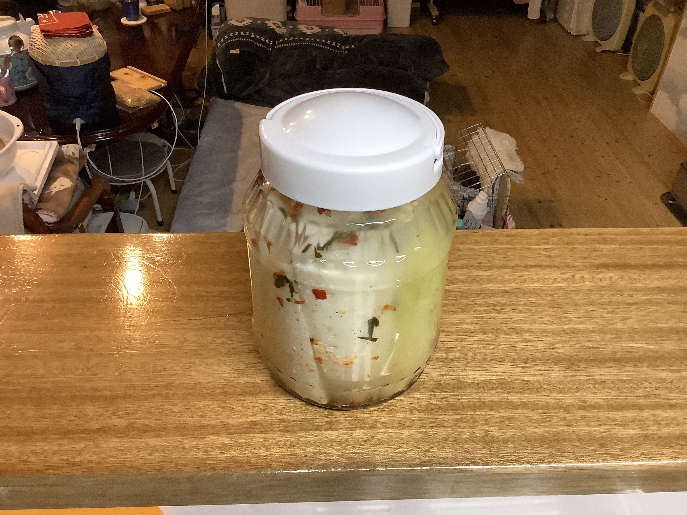
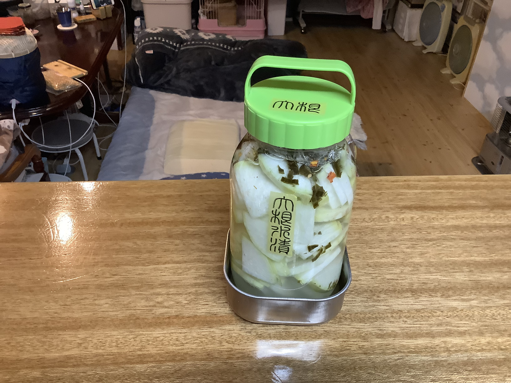

# 大根の水漬け

### 📅 YYYY-MM-DD

##### 🥣 recipe（いい感じ👍）

##### PyKeysのREPL用ワンライナー
実行するとクリップボードにテーブルがコピーされる。

~~~python
x=369; I='大根 水 漬け汁 塩 合計'.split(); r=[369,300,100]; s_s=[0,0,0.03]; salt=0.03; import clipboard; b_r=r[0]; r_norm=[v/b_r for v in r]; s_r=sum(r_norm); liq_s=sum(v*s for v,s in zip(r_norm, s_s)); t_r=max(s_r, (s_r-liq_s)/(1-salt)); s_amt=max(0, t_r-s_r); act_s=(liq_s+s_amt)/t_r; R=r_norm+[s_amt, t_r]; N=[f'塩分:{round(s*100,1)}%' if s != 0 else '' for s in s_s]+[f'塩分:100%']+[f'全体塩分:{round(act_s*100,1)}%']; res="|材料|割合|分量|%|備考|\n|:-:|:-:|:-:|:-:|:-:|\n"+"\n".join(f"|**{n}**|{round(v*b_r,2) if i<len(r) else round(v,2)}|{round(x*v,1)}{'ml' if n in['水','醤油','酒'] else 'g'}|{round(v/t_r*100,1)}%|{note}|" for i,(n,v,note) in enumerate(zip(I,R,N))); clipboard.set(res)
~~~

##### 📝 コメント

---

### 📅 2026-04-04  大根の水漬け 2200ml

##### 🥣 recipe（いい感じ👍）

|材料|割合|分量|%|備考|
|:-:|:-:|:-:|:-:|:-:|
|**大根**|1367.0|1367.0g|61.4%||
|**水**|500.0|500.0ml|22.5%||
|**漬け汁**|300.0|300.0g|13.5%|塩分:3.0%|
|**塩**|0.04|57.7g|2.6%|塩分:100%|
|**合計**|1.63|2224.7g|100.0%|全体塩分:3.0%|
##### PyKeysのREPL用ワンライナー
実行するとクリップボードにテーブルがコピーされる。

~~~python
x=1367; I='大根 水 漬け汁 塩 合計'.split(); r=[1367,500,300]; s_s=[0,0,0.03]; salt=0.03; import clipboard; b_r=r[0]; r_norm=[v/b_r for v in r]; s_r=sum(r_norm); liq_s=sum(v*s for v,s in zip(r_norm, s_s)); t_r=max(s_r, (s_r-liq_s)/(1-salt)); s_amt=max(0, t_r-s_r); act_s=(liq_s+s_amt)/t_r; R=r_norm+[s_amt, t_r]; N=[f'塩分:{round(s*100,1)}%' if s != 0 else '' for s in s_s]+[f'塩分:100%']+[f'全体塩分:{round(act_s*100,1)}%']; res="|材料|割合|分量|%|備考|\n|:-:|:-:|:-:|:-:|:-:|\n"+"\n".join(f"|**{n}**|{round(v*b_r,2) if i<len(r) else round(v,2)}|{round(x*v,1)}{'ml' if n in['水','醤油','酒'] else 'g'}|{round(v/t_r*100,1)}%|{note}|" for i,(n,v,note) in enumerate(zip(I,R,N))); clipboard.set(res)
~~~

##### 📝 コメント

2026-04-04 15:21 大根の水漬け2200ml。

 

---

### 📅 2026-04-04 大根の水漬け 700ml

##### 🥣 recipe（いい感じ👍）

|材料|割合|分量|%|備考|
|:-:|:-:|:-:|:-:|:-:|
|**大根**|369.0|369.0g|46.7%||
|**水**|300.0|300.0ml|38.0%||
|**漬け汁**|100.0|100.0g|12.7%|塩分:3.0%|
|**塩**|0.06|20.7g|2.6%|塩分:100%|
|**合計**|2.14|789.7g|100.0%|全体塩分:3.0%|
##### PyKeysのREPL用ワンライナー
実行するとクリップボードにテーブルがコピーされる。

~~~python
x=369; I='大根 水 漬け汁 塩 合計'.split(); r=[369,300,100]; s_s=[0,0,0.03]; salt=0.03; import clipboard; b_r=r[0]; r_norm=[v/b_r for v in r]; s_r=sum(r_norm); liq_s=sum(v*s for v,s in zip(r_norm, s_s)); t_r=max(s_r, (s_r-liq_s)/(1-salt)); s_amt=max(0, t_r-s_r); act_s=(liq_s+s_amt)/t_r; R=r_norm+[s_amt, t_r]; N=[f'塩分:{round(s*100,1)}%' if s != 0 else '' for s in s_s]+[f'塩分:100%']+[f'全体塩分:{round(act_s*100,1)}%']; res="|材料|割合|分量|%|備考|\n|:-:|:-:|:-:|:-:|:-:|\n"+"\n".join(f"|**{n}**|{round(v*b_r,2) if i<len(r) else round(v,2)}|{round(x*v,1)}{'ml' if n in['水','醤油','酒'] else 'g'}|{round(v/t_r*100,1)}%|{note}|" for i,(n,v,note) in enumerate(zip(I,R,N))); clipboard.set(res)
~~~

##### 📝 コメント

2026-04-04 15:20 大根の水漬け700ml。

---